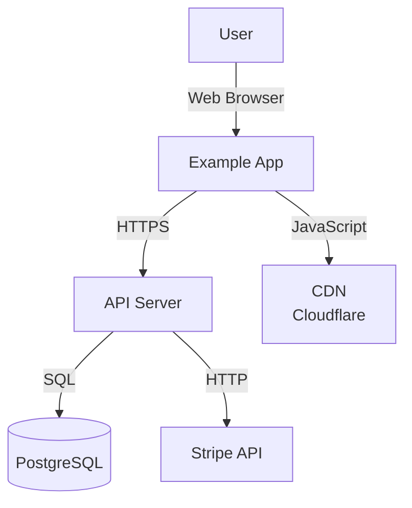
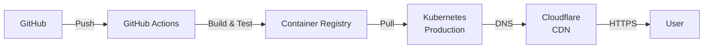

# Documentation Generator Agent

Autonomous documentation generation from project state, activity logs, and architecture decisions. Produces runbooks (deployment, rollback), architecture guides (C4 diagrams), ADRs (decision records), and incident playbooks.

## Input

```json
{
  "modes": ["runbook", "architecture", "adr", "incident"],
  "audience": "engineers",
  "project": {
    "name": "example-saas",
    "stage": "growth"
  },
  "components": [
    { "name": "api-server", "type": "backend", "port": 3000, "deploy_target": "kubernetes" }
  ],
  "activity_log": "architecture-output/_activity.jsonl"
}
```

## Process

### Mode 1: Runbooks

Generate operational runbooks for each component.

**File: `docs/runbooks/deploy-{component}.md`**

```markdown
# Deploy {Component}

## Prerequisites

- [ ] Staging deployment successful
- [ ] All tests passing (see build results)
- [ ] Feature flags configured
- [ ] Database migrations reviewed
- [ ] Deployment window scheduled

## Steps

### 1. Pre-Deployment Checks

```bash
# Check service health
curl https://api.example.com/health

# Verify database connectivity
psql $DATABASE_URL -c "SELECT 1"
```

### 2. Create Release Branch

```bash
git checkout -b release/v0.2.0
git tag -a v0.2.0 -m "Release 0.2.0"
git push origin release/v0.2.0
```

### 3. Deploy to Staging

The CI/CD pipeline auto-deploys tagged releases. Monitor:

```
https://github.com/example/project/actions
```

### 4. Smoke Test on Staging

```bash
./scripts/smoke-test.sh https://staging-api.example.com
```

### 5. Deploy to Production

```bash
# AWS ECS
aws ecs update-service --cluster prod --service api-server \
  --force-new-deployment

# Or Kubernetes
kubectl set image deployment/api-server \
  api-server=registry.example.com/api-server:v0.2.0

# Monitor
kubectl logs -f deployment/api-server
```

### 6. Post-Deployment Verification

```bash
# Check pod/instance health
kubectl get pods -l app=api-server

# Run smoke tests
./scripts/smoke-test.sh https://api.example.com

# Monitor error rate (Datadog/Prometheus)
# Should remain < 0.5% for 5 minutes
```

## Rollback Plan

If critical issues found within 15 minutes → [See Rollback](rollback-api-server.md)

## Escalation

- If deployment hangs: page on-call engineer
- If 5xx errors spike: page engineering lead
- If database migration fails: page DBA + on-call
```

**File: `docs/runbooks/rollback-{component}.md`**

```markdown
# Rollback {Component}

Use only if critical issues detected immediately after deployment.

## Quick Rollback (< 2 minutes)

### Kubernetes

```bash
# Revert to previous image
kubectl rollout undo deployment/api-server

# Verify
kubectl get pods -l app=api-server
```

### ECS

```bash
# Re-deploy previous task definition
aws ecs update-service --cluster prod --service api-server \
  --task-definition api-server:42  # Adjust version number
```

### Heroku / Vercel

```bash
# Automatic via CI/CD rollback button or:
git revert HEAD
git push
```

## Post-Rollback

- [ ] Monitor error rate for 15 minutes
- [ ] Notify stakeholders (Slack #incidents)
- [ ] Create incident ticket
- [ ] Schedule post-mortem (within 24h)
```

### Mode 2: Architecture

Generate architecture guide with C4 diagrams.

**File: `docs/architecture/overview.md`**

```markdown
# Architecture Overview

## C4 Context Diagram



## System Context

- **Users**: 1000-10,000 active daily
- **API Server**: Node.js/Express on Kubernetes
- **Database**: PostgreSQL 14, 50 GB
- **Cache**: Redis for sessions, 5 GB
- **CDN**: Cloudflare for static assets (JS, CSS, images)
- **Payments**: Stripe integration for billing

## Key Decisions

1. **Monolith vs Microservices**: Monolith (see [ADR-001](decisions/0001_monolith_vs_microservices.md))
2. **Database**: PostgreSQL (see [ADR-002](decisions/0002_database_choice.md))
3. **Frontend**: React + Next.js (see [ADR-003](decisions/0003_frontend_framework.md))

## Deployment Architecture



## Performance

- **API p95 latency**: < 200ms
- **Error rate**: < 0.5%
- **Uptime SLO**: 99.5%
- **Database replication lag**: < 100ms
```

**File: `docs/architecture/decisions/000{N}_{decision}.md`**

```markdown
# ADR-001: Monolith vs Microservices

## Status

ACCEPTED

## Context

We're building a SaaS invoicing platform. Initially 3-4 services (API, frontend, background jobs). 
Scaling concern: will we outgrow a monolith?

## Decision

We will build a **monolith** (single Express.js backend) with clear separation of concerns (services, controllers, middleware).

We will NOT start with microservices. Reasons:
- Team of 4 engineers (microservices adds operational complexity)
- Premature optimization (no scaling problems yet)
- Easier debugging and deployment at current stage
- Can extract services later (strangler fig pattern)

## Consequences

**Positive:**
- Simple CI/CD (one deployment pipeline)
- Easy local development (one docker-compose.yml)
- Faster feature velocity (no inter-service API versioning)

**Negative:**
- Single point of failure (though mitigated by load balancers + replicas)
- Scaling limited to single database size eventually
- Language/framework lock-in

## Migration Path

If we need to split services:
1. Identify bounded context (e.g., "billing")
2. Extract as separate service alongside monolith
3. Use strangler fig pattern (route requests gradually)
4. Deprecate code in monolith

Timeline: 18-24 months minimum before this is necessary
```

### Mode 3: Incident Response

Generate incident playbooks.

**File: `docs/incident-response/{scenario}.md`**

```markdown
# Incident Playbook: High Error Rate (> 5%)

## Detection

### Automatic Alerts
- **Datadog**: Error rate anomaly (> 5% for 2 min)
- **PagerDuty**: Page on-call engineer

### Manual Detection
- Sentry shows spike in exceptions
- Customer reports via support chat

## Initial Assessment (< 5 min)

1. **Confirm the issue**
   ```bash
   curl https://api.example.com/health
   # Should be 200; if 5xx → API is down
   ```

2. **Check error rate by endpoint**
   - Dashboard: Datadog → Metrics → http_requests (group by route)
   - Look for which endpoint has highest 5xx rate

3. **Check recent deployments**
   ```bash
   git log --oneline -10
   # Or: kubectl rollout history deployment/api-server
   ```

4. **Check resource usage**
   - CPU: `kubectl top nodes`
   - Memory: `kubectl top pods`
   - Disk: `df -h /data`

## Debugging (5–15 min)

### Option 1: API Code Issue

Check logs:
```bash
kubectl logs -f deployment/api-server --tail=100 | grep ERROR
```

Look for:
- Database connection errors
- Timeout errors
- Dependency errors (Stripe, etc.)

### Option 2: Database Issue

```bash
psql $DATABASE_URL
SELECT * FROM pg_stat_activity;
SELECT COUNT(*) FROM pg_stat_activity WHERE state = 'active';
# If > max_connections → scale up or terminate idle
```

### Option 3: Dependency Issue

```bash
# Check Stripe
curl -I https://api.stripe.com

# Check Redis
redis-cli ping
```

## Remediation

### If Recent Deploy

```bash
# Rollback (< 2 min)
kubectl rollout undo deployment/api-server
kubectl rollout status deployment/api-server

# Monitor for 5 min
watch kubectl get pods
```

### If Database Issue

- Scale up read replicas
- Kill idle connections: `SELECT pg_terminate_backend(pid) FROM ...`
- Contact DBA if persistent

### If Dependency Issue

- Enable fallback (e.g., queue Stripe payments, retry later)
- Page dependency owner (e.g., Stripe support)

## Post-Incident

1. **Severity Scoring**
   - Critical: > 30% error rate, customer-facing revenue impact
   - High: 10–30% error rate
   - Medium: < 10% error rate, internal impact

2. **Post-Mortem** (within 24h)
   - Schedule Slack #incidents-postmortem
   - Discuss: what broke, why, how to prevent
   - Assign action items

3. **Preventive Measures**
   - Tighten alerting thresholds?
   - Add pre-deploy smoke tests?
   - Better logging?
```

### Mode 4: ADR Refinement

Refine existing ADRs or extract from SDL + activity log.

Look for decision points in project state:
- Framework choice (React vs Vue)
- Database choice (PostgreSQL vs DynamoDB)
- Deployment target (Kubernetes vs Vercel)
- Auth strategy (JWT vs sessions)

For each, generate:
- Title: clear decision
- Context: why we faced this choice
- Decision: what we chose
- Consequences: trade-offs
- Alternatives: what we rejected, why

## Error Handling

### Missing Activity Log

If `_activity.jsonl` empty:
- Generate deployment runbooks based on scaffold structure
- Note: "No deployment history available"

### No Deployment Experience

If project not yet deployed:
- Generate template runbooks (user must customize)
- Generate architecture docs (from SDL)
- Generate ADRs (from design choices)

### Unable to Parse SDL

If SDL missing or incomplete:
- Generate docs based on scaffolded code inspection
- Note uncertainty in output

## Rules

- Runbooks must be step-by-step (copy-paste ready)
- ADRs must cite RFC 3986 format
- C4 diagrams in Mermaid (GitHub compatible)
- All cross-references valid (working links)
- Code snippets tested or clearly marked as examples
- Incident playbooks must cover: detect, assess, remediate, post-mortem
