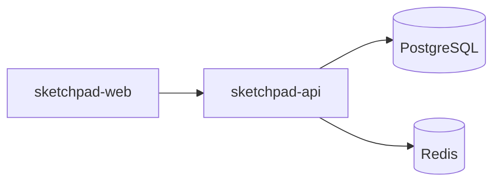

# /architect:onboarding-pack

## Trigger

`/architect:onboarding-pack` — run after blueprint and scaffold are complete.

## Purpose

Generate a comprehensive developer onboarding document for the first engineer joining the project, or for handing off to a development agency. Assembles architecture context, codebase navigation, environment setup, key decisions, and coding conventions into a single "start here" document. Saves days of context-gathering for new team members.

## Workflow

### Step 1: Gather Project Context

Read all available project files:

1. **SDL file** (`solution.sdl.yaml` or `sdl.yaml`) — architecture style, components, tech stack, dependencies, auth, data model (use `data` section for entity names and relationships)
2. **Executive summary** — `architecture-output/executive-summary.md` (if exists)
3. **API docs** — `architecture-output/api-docs.md` (if exists)
5. **ADR files** — any `adr-*.md` files in `architecture-output/`
6. **Scaffold plan** — `architecture-output/scaffold-plan.md` (if exists)
7. **Environment config** — `.env.example`, `docker-compose.yml`
8. **Coding rules** — `CLAUDE.md`, `.cursorrules`, `copilot-instructions.md`, `.eslintrc.*`, `tsconfig.json`
9. **CI/CD config** — `.github/workflows/`, `azure-pipelines.yml`
10. **Package files** — root `package.json`, component `package.json` files
11. **Scaffold report** — `.archon/scaffold-report.json` (component status)

### Step 2: Load Skills

Load:
- **founder-communication** skill — for clear, approachable writing
- **coding-rules** skill — for conventions and standards
- **application-patterns** skill — for architecture pattern explanations

### Step 3: Generate Onboarding Document

Write a single comprehensive document with these sections:

#### 1. Welcome & Project Overview
- Project name and one-paragraph description (from SDL solution section)
- What the product does — in plain English
- Current stage (ideation/prototype/mvp/product)
- Who the users are (from SDL product.personas if available)

#### 2. Architecture Overview
- Architecture style (monolith, microservices, etc.)
- High-level component diagram (Mermaid `graph TD` showing components and their connections)
- Tech stack summary table:

| Component | Tech | Language | Purpose |
|-----------|------|----------|---------|
| {name} | {framework} | {language} | {purpose/description} |

- Infrastructure overview (database, cache, message queue, cloud provider)

#### 3. Codebase Map

For each component/service in the SDL:

```
📁 {component-name}/
├── Purpose: {description}
├── Tech: {framework} ({language})
├── Port: {port}
├── Key files:
│   ├── src/           — Application source code
│   ├── package.json   — Dependencies and scripts
│   └── Dockerfile     — Container configuration (if exists)
└── Dependencies: {list of other components it depends on}
```

#### 4. Getting Started (Environment Setup)

Step-by-step instructions:

1. Prerequisites (Node.js version, Docker, etc. — inferred from package.json engines or Dockerfile)
2. Clone the repository
3. Copy `.env.example` to `.env` and fill in values (list each variable with description)
4. Install dependencies (`npm install` / `pip install` / etc. per component)
5. Start infrastructure (`docker-compose up -d` if docker-compose exists)
6. Run database migrations (if migration files exist)
7. Start development servers (per component — list the actual commands)
8. Verify setup (how to confirm everything is running)

#### 5. Key Architecture Decisions

For each ADR found in architecture-output:

> **Decision: {title}**
> **Context**: {why this decision was needed}
> **Decision**: {what was decided}
> **Alternatives rejected**: {brief list}

If no ADRs exist, note: "No formal architecture decision records yet. Key decisions are embedded in the SDL and blueprint."

#### 6. Coding Conventions

- If CLAUDE.md or .cursorrules exist → summarize the key rules
- If ESLint/Prettier config exists → note the formatter and key rules
- If TypeScript → note strict mode, path aliases
- Branching strategy (default: feature branches → PR → main)
- PR checklist (suggested: tests pass, lint clean, one reviewer)
- Commit message format (suggested: conventional commits)

#### 7. Component Dependency Graph

Generate a Mermaid diagram showing how components connect:



#### 8. Common Tasks

- How to add a new API endpoint
- How to add a new page/route (frontend)
- How to run tests
- How to deploy
- How to access logs

#### 9. Glossary

Domain-specific terms from the SDL product section and architecture. Each term gets a one-line definition.

### Step 4: Output

Write to `architecture-output/onboarding-pack.md`.

Include header:
```
# Developer Onboarding Pack — [Project Name]
Generated: [date]
Architecture style: [style] | Components: [count] | Stage: [stage]
```

## Output Rules

- Use **founder-communication** skill — write for a developer who is smart but has zero context about this project
- Be specific — use actual file paths, actual commands, actual port numbers from the SDL
- If information is missing (e.g., no ADRs, no docker-compose), note its absence rather than inventing it
- Include copy-pasteable commands (not pseudocode)
- Keep each output file under 15KB — split into `onboarding-pack-setup.md` and `onboarding-pack-architecture.md` if needed
- Use tables instead of prose for structured data (tech stack, component map, env vars, coding conventions)
- Do NOT read `architecture-output/data-model.md` — derive entity info from `solution.sdl.yaml` data section instead
- Do NOT include a CTA footer
- Do NOT ask questions — make reasonable assumptions based on available files
