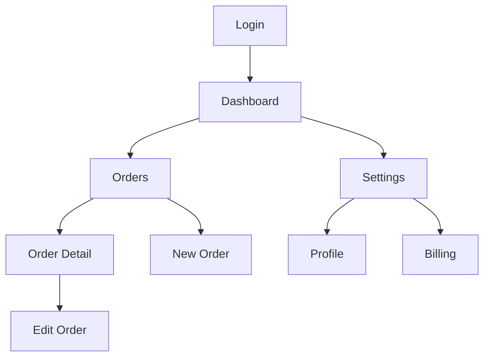

# /architect:wireframes

## Trigger

`/architect:wireframes` — run after blueprint and design-system phases.

## Purpose

Generate low-fidelity HTML wireframes for every screen in the product. Screens are inferred from SDL core flows, data models, and component types. Each wireframe is a standalone HTML file styled with the project's design tokens, linked together for click-through navigation. Outputs a screen inventory and navigation map.

## Workflow

### Step 1: Gather Inputs

Read:
1. **SDL file** — components, auth, data models, core flows
2. **Design tokens** — `architecture-output/design-system/design-tokens.json` or SDL `design` section
3. **Data model** — `architecture-output/data-model.md` for entity fields and relationships

### Step 2: Load Skills

Load:
- **wireframe-patterns** skill — screen type templates
- **design-system** skill — token application rules
- **founder-communication** skill — plain English labels

### Step 3: Build Screen Inventory

**Priority: If `product.screens` exists in SDL, use it as the screen inventory** (user-defined via the Screen Flow Editor, takes precedence over inference). Use `product.screenFlows` for navigation links between wireframes.

**Otherwise, infer screens from the SDL:**

1. **Auth screens** (if SDL has `auth` section):
   - Login, Register, Forgot Password
   - OAuth callback (if OAuth configured)

2. **Dashboard / Home** (always — entry point after login)

3. **Entity CRUD screens** (from `data` section entities):
   - For each entity: List view, Detail view, Create/Edit form
   - Example: `Order` entity → Orders List, Order Detail, Create Order

4. **Core flow screens** (from `product.coreFlows`):
   - Map each flow step to a screen state
   - Example: "Checkout" flow → Cart → Shipping → Payment → Confirmation

5. **Settings** (always):
   - Profile, Account Settings
   - Billing (if subscriptions in SDL)
   - Team (if multi-tenant)

6. **Landing page** (if frontend component type is 'marketing' or 'landing')

### Step 4: Generate Wireframes

For each screen in the inventory:

1. Create an HTML file: `architecture-output/wireframes/{screen-name}.html`
2. Apply design tokens as CSS variables:
   - `--color-primary`, `--color-secondary`, `--font-heading`, `--font-body`
   - `--radius`, `--shadow`, `--spacing`
3. Use the appropriate screen type template from **wireframe-patterns** skill
4. Populate with:
   - Real field names from data models
   - Real navigation items from screen inventory
   - Realistic placeholder data (names, emails, dates — not "lorem ipsum")
   - Working `<a>` links between wireframe pages
5. Include a shared navigation header across all pages

### Step 5: Generate Navigation Map

Create `architecture-output/wireframes/navigation-map.mmd`:



### Step 6: Generate Index Page

Create `architecture-output/wireframes/index.html`:
- Lists all screens with links
- Shows the navigation map (embedded Mermaid)
- Summary: "X screens generated from Y core flows and Z entities"

### Step 7: Output

Write all files to `architecture-output/wireframes/`:
```
architecture-output/wireframes/
├── index.html              # Screen inventory + nav map
├── navigation-map.mmd      # Mermaid navigation flowchart
├── login.html
├── register.html
├── dashboard.html
├── orders-list.html
├── order-detail.html
├── create-order.html
├── settings-profile.html
├── settings-billing.html
└── ...
```

## Output Rules

- Use **wireframe-patterns** skill for consistent screen layouts
- Use **founder-communication** skill — labels understandable by non-technical stakeholders
- Every wireframe must be a valid standalone HTML file (inline CSS, no external deps)
- All wireframes must share consistent navigation and design token styling
- Links between pages must work when opened in a browser
- Use semantic HTML (header, nav, main, section, form)
- Include `<meta viewport>` for mobile preview
- Do NOT generate JavaScript — wireframes are static HTML only
- Do NOT ask questions — infer all screens from SDL
