```mermaid
graph TB
    subgraph "Interface"
        Slack["💬 Slack Bot<br/><i>Slack Bolt SDK</i>"]
    end

    subgraph "Agent Service"
        API["⚙️ FastAPI Server<br/><i>Python</i>"]
        Agent["🤖 Support Agent<br/><i>Claude Sonnet</i>"]
    end

    subgraph "Data"
        DB[("🗄️ PostgreSQL<br/><i>Conversations, tickets</i>")]
        Vector[("🔍 pgvector<br/><i>Knowledge embeddings</i>")]
    end

    subgraph "External"
        Claude["🤖 Anthropic API<br/><i>Claude Sonnet</i>"]
        SlackAPI["💬 Slack API<br/><i>Events + messages</i>"]
    end

    Slack -->|"Events<br/>HTTPS / JSON"| API
    API -->|"Orchestrates"| Agent
    Agent -->|"Vector search"| Vector
    Agent -->|"Read/write history"| DB
    Agent -->|"LLM calls<br/>HTTPS / JSON"| Claude
    API -->|"Post responses<br/>HTTPS / JSON"| SlackAPI

    style Slack fill:#4a90d9,stroke:#2c5ea0,color:#fff
    style API fill:#5cb85c,stroke:#3d8b3d,color:#fff
    style Agent fill:#e74c3c,stroke:#c0392b,color:#fff
    style DB fill:#f0ad4e,stroke:#c77c00,color:#fff
    style Vector fill:#f0ad4e,stroke:#c77c00,color:#fff
    style Claude fill:#e74c3c,stroke:#c0392b,color:#fff
    style SlackAPI fill:#9b59b6,stroke:#6c3483,color:#fff
```

```mermaid
graph TB
    subgraph "Frontend"
        WebApp["🌐 Web App<br/><i>Next.js</i>"]
    end

    subgraph "Backend"
        API["⚙️ API Server<br/><i>Node.js / Express</i>"]
        Assistant["🤖 AI Assistant<br/><i>Claude Haiku</i>"]
        Worker["⏰ Background Worker<br/><i>BullMQ</i>"]
    end

    subgraph "Data"
        DB[("🗄️ MongoDB<br/><i>Projects, tasks, users</i>")]
        Cache[("⚡ Redis<br/><i>Sessions + job queue</i>")]
    end

    subgraph "External Services"
        Claude["🤖 Anthropic API<br/><i>Claude Haiku</i>"]
        Auth0["🔐 Auth0<br/><i>Authentication + SSO</i>"]
        Stripe["💳 Stripe<br/><i>Subscriptions</i>"]
        Resend["📧 Resend<br/><i>Notifications</i>"]
    end

    WebApp -->|"REST API + SSE<br/>JWT / JSON"| API
    API -->|"Reads/writes"| DB
    API -->|"Sessions + queue"| Cache
    API -->|"Orchestrates"| Assistant
    Assistant -->|"LLM calls<br/>HTTPS / JSON"| Claude
    Assistant -->|"Reads project context"| DB
    Worker -->|"Processes jobs from"| Cache
    Worker -->|"Sends notifications"| Resend
    API -->|"Auth checks<br/>HTTPS / JWT"| Auth0
    API -->|"Billing<br/>HTTPS / JSON"| Stripe

    style WebApp fill:#4a90d9,stroke:#2c5ea0,color:#fff
    style API fill:#5cb85c,stroke:#3d8b3d,color:#fff
    style Assistant fill:#e74c3c,stroke:#c0392b,color:#fff
    style Worker fill:#5cb85c,stroke:#3d8b3d,color:#fff
    style DB fill:#f0ad4e,stroke:#c77c00,color:#fff
    style Cache fill:#f0ad4e,stroke:#c77c00,color:#fff
    style Claude fill:#e74c3c,stroke:#c0392b,color:#fff
    style Auth0 fill:#9b59b6,stroke:#6c3483,color:#fff
    style Stripe fill:#9b59b6,stroke:#6c3483,color:#fff
    style Resend fill:#9b59b6,stroke:#6c3483,color:#fff
```

# Example Blueprint Outputs

> **Architect AI — Cowork Plugin Reference**
> These examples demonstrate the correct format, structure, and quality level for blueprint outputs. Example 1 shows all 15 deliverables. Examples 2 and 3 show condensed versions for different project types.

---

## Example 1: E-commerce Marketplace (Full 15-Deliverable Blueprint)

**Project type:** `app` | **Stack:** Next.js, Node.js, PostgreSQL, Redis, Stripe, SendGrid

### 4a. Executive Summary

An online marketplace where sellers list products and buyers browse, purchase, and leave reviews. The platform handles user registration, product listings with images, a shopping cart, Stripe-powered checkout, order management, and transactional email notifications via SendGrid. Redis provides caching for product catalog pages and manages the background job queue for order processing and email delivery.

| Metric | Value |
|--------|-------|
| Project type | App (web) |
| Core stack | Next.js + Node.js API + PostgreSQL |
| Architecture pattern | Modular monolith, feature-based folders |
| Estimated build time | 6-10 weeks (experienced developer) |
| Monthly infrastructure | $50-300 |
| Complexity | 5/10 — Moderate |
| Top 3 risks | Stripe webhook reliability, search scaling, image storage costs |

### 4b. Architecture Diagram



```mermaid
graph TB
    subgraph "Frontend"
        WebApp["🌐 Web App<br/><i>Next.js</i>"]
    end

    subgraph "Backend"
        API["⚙️ API Server<br/><i>Node.js / Express</i>"]
        Worker["⏰ Background Worker<br/><i>BullMQ</i>"]
    end

    subgraph "Data"
        DB[("🗄️ PostgreSQL<br/><i>Products, orders, users</i>")]
        Cache[("⚡ Redis<br/><i>Cache + job queue</i>")]
    end

    subgraph "External Services"
        Stripe["💳 Stripe<br/><i>Payments</i>"]
        SendGrid["📧 SendGrid<br/><i>Transactional email</i>"]
        S3["📦 Cloudflare R2<br/><i>Product images</i>"]
    end

    WebApp -->|"REST API<br/>JWT / JSON"| API
    API -->|"Reads/writes<br/>Prisma / SQL"| DB
    API -->|"Cache + enqueue<br/>ioredis / JSON"| Cache
    Worker -->|"Process jobs<br/>BullMQ / JSON"| Cache
    Worker -->|"Updates"| DB
    API -->|"Checkout + webhooks<br/>HTTPS / JSON"| Stripe
    Worker -->|"Sends order emails<br/>HTTPS / JSON"| SendGrid
    API -->|"Upload/serve images<br/>HTTPS / multipart"| S3

    style WebApp fill:#4a90d9,stroke:#2c5ea0,color:#fff
    style API fill:#5cb85c,stroke:#3d8b3d,color:#fff
    style Worker fill:#5cb85c,stroke:#3d8b3d,color:#fff
    style DB fill:#f0ad4e,stroke:#c77c00,color:#fff
    style Cache fill:#f0ad4e,stroke:#c77c00,color:#fff
    style Stripe fill:#9b59b6,stroke:#6c3483,color:#fff
    style SendGrid fill:#9b59b6,stroke:#6c3483,color:#fff
    style S3 fill:#9b59b6,stroke:#6c3483,color:#fff
```

### 4c. Application Architecture & Patterns

**Architecture pattern:** Modular monolith

The API server is a single deployable service organized into self-contained modules (products, orders, users, payments). Each module owns its routes, business logic, and database queries. This avoids microservice overhead while maintaining clear boundaries. If any module needs to scale independently later, extracting it into a separate service is straightforward.

**Folder structure** (feature-based):

```
api-server/
├── src/
│   ├── features/
│   │   ├── auth/
│   │   │   ├── auth.routes.ts
│   │   │   ├── auth.service.ts
│   │   │   └── auth.middleware.ts
│   │   ├── products/
│   │   │   ├── products.routes.ts
│   │   │   ├── products.service.ts
│   │   │   └── products.validators.ts
│   │   ├── orders/
│   │   │   ├── orders.routes.ts
│   │   │   ├── orders.service.ts
│   │   │   └── orders.validators.ts
│   │   └── payments/
│   │       ├── payments.routes.ts
│   │       ├── payments.service.ts
│   │       └── stripe.webhook.ts
│   ├── shared/
│   │   ├── middleware/
│   │   ├── errors/
│   │   └── types/
│   └── index.ts
├── prisma/
│   ├── schema.prisma
│   └── migrations/
└── package.json
```

**Key principles:**
1. Single responsibility — each feature module owns one domain
2. Fail fast — validate at route boundaries with Zod, trust internal data
3. Dependency inversion — business logic in services, no framework imports in service layer

**Error handling:** Structured error codes with `{ code, message, details }`. Routes catch service errors and map to HTTP status codes. Stripe webhook errors are logged and retried.

**Testing strategy:** Unit tests for business logic (service layer), integration tests for API endpoints (supertest), Stripe webhook replay tests for payment flows.

### 4d. Shared Types & Cross-Service Contracts

**Shared types:**

| Type | Key Fields | Used By |
|------|-----------|---------|
| `User` | id, email, role, displayName, createdAt | API server, storefront |
| `Product` | id, sellerId, title, price, images, status | API server, storefront, worker |
| `Order` | id, buyerId, sellerId, items, total, status | API server, storefront, worker |
| `Review` | id, productId, userId, rating, comment | API server, storefront |

**Shared library:** `@marketplace/shared-types` — TypeScript type definitions consumed by both the API server and the Next.js storefront. Published as a workspace package in the monorepo.

**Inter-service communication:**

| From | To | Pattern | Protocol | Auth | Data Format | Sync/Async |
|------|----|---------|----------|------|-------------|------------|
| Storefront | API Server | REST | HTTPS | JWT bearer | JSON | Sync |
| API Server | PostgreSQL | SQL | TCP/SSL | Connection string | SQL/Prisma | Sync |
| API Server | Redis | Redis protocol | TCP | Password | JSON | Sync |
| API Server | Worker | Message queue | Redis/BullMQ | Internal | JSON | Async |
| Worker | SendGrid | REST | HTTPS | API key | JSON | Sync |
| API Server | Stripe | REST | HTTPS | API key | JSON | Sync |
| Stripe | API Server | Webhook | HTTPS | Signature verification | JSON | Async |

### 4e. API Artifacts

**Artifact summary:**

| Artifact | Service | Format | What It Covers |
|----------|---------|--------|----------------|
| OpenAPI spec | api-server | YAML | All REST endpoints, schemas, auth |
| Postman collection | api-server | JSON | Pre-built requests, env vars, examples |
| AsyncAPI spec | worker | YAML | Job queue message schemas |

**OpenAPI 3.1 spec (abbreviated):**

```yaml
openapi: 3.1.0
info:
  title: CraftBazaar API
  version: 0.1.0
  description: REST API for the CraftBazaar marketplace
servers:
  - url: http://localhost:3000
    description: Local development
  - url: https://api.craftbazaar.com
    description: Production
paths:
  /products:
    get:
      summary: List products
      parameters:
        - name: page
          in: query
          schema: { type: integer, default: 1 }
        - name: limit
          in: query
          schema: { type: integer, default: 20, maximum: 100 }
        - name: category
          in: query
          schema: { type: string }
      responses:
        '200':
          description: Paginated product list
          content:
            application/json:
              schema:
                type: object
                properties:
                  data: { type: array, items: { $ref: '#/components/schemas/Product' } }
                  pagination: { $ref: '#/components/schemas/Pagination' }
    post:
      summary: Create product listing
      security: [{ bearerAuth: [] }]
      requestBody:
        content:
          application/json:
            schema: { $ref: '#/components/schemas/CreateProduct' }
      responses:
        '201': { description: Product created }
        '401': { description: Unauthorized }
  /orders:
    post:
      summary: Place an order
      security: [{ bearerAuth: [] }]
      # ... endpoints continue
components:
  schemas:
    Product:
      type: object
      properties:
        id: { type: string, format: uuid }
        sellerId: { type: string, format: uuid }
        title: { type: string, example: "Handmade Ceramic Mug" }
        price: { type: number, example: 24.99 }
        status: { type: string, enum: [draft, active, sold] }
  securitySchemes:
    bearerAuth:
      type: http
      scheme: bearer
      bearerFormat: JWT
```

Import into Swagger UI or Redoc for interactive API documentation. Import into Postman for immediate API testing.

### 4f. Security Architecture

**Auth strategy:** JWT (JSON Web Token) with refresh tokens via Clerk. Clerk handles signup, login, password reset, and social auth. The API server validates JWTs on every request using Clerk's middleware.

**API security checklist:**

| Protection | Implementation | Applies To | Priority |
|-----------|---------------|------------|----------|
| Rate limiting | Upstash Ratelimit — 100 req/min/user | API server | Must-have |
| Input validation | Zod schemas on all request bodies | API server | Must-have |
| CORS | Whitelist storefront origin only | API server | Must-have |
| Helmet headers | CSP, HSTS, X-Frame-Options | API server | Must-have |
| Stripe webhook verification | Signature verification on webhook endpoint | API server | Must-have |
| SQL injection prevention | Prisma parameterized queries | API server | Must-have |
| File upload validation | Type + size checks on image uploads | API server | Should-have |

**Data protection:**
- **Encryption at rest:** AES-256 via database provider (Neon/RDS)
- **Encryption in transit:** TLS 1.3 on all external endpoints
- **PII fields:** email, displayName, shippingAddress, phone
- **Data retention:** User data retained while account is active, deleted 30 days after account deletion request

**OWASP considerations:**

| Threat | Mitigation |
|--------|-----------|
| Broken access control | Role-based middleware. Sellers can only edit own listings. Buyers can only view own orders. |
| Injection | Prisma parameterized queries. Zod validation on all user input. |
| SSRF | No user-provided URLs fetched server-side. Image URLs are generated internally. |

### 4g. Observability & Monitoring

**Logging:** Structured JSON logs via `pino`. Log levels: error, warn, info, debug. Never log: passwords, tokens, full credit card numbers, PII in query strings.

**Health checks:**

| Service | Endpoint | Checks |
|---------|----------|--------|
| API server | `/health` | PostgreSQL connectivity, Redis connectivity |
| API server | `/health/ready` | Above + Stripe API reachability |
| Worker | `/health` | Redis connectivity |

**Key metrics:**

| Metric | Alert Threshold | Why It Matters |
|--------|----------------|----------------|
| Error rate | > 5% for 5 min | Something is broken |
| API latency p99 | > 2s | User experience degradation |
| Worker queue depth | > 500 | Jobs backing up |
| Payment webhook failures | > 3 in 5 min | Revenue-impacting |

**Monitoring stack (MVP):**

| Tool | Purpose | Cost |
|------|---------|------|
| Sentry | Error tracking + performance | $0 (free tier) |
| Vercel Analytics | Frontend performance | $0 (included) |
| Uptime monitoring | Health check pings | $0 (Better Stack free) |

Distributed tracing is not needed at MVP scale. Add OpenTelemetry when moving to multi-service production.

### 4h. DevOps Blueprint

**CI/CD Pipeline (GitHub Actions):**

```
Push to feature branch → Lint → Test → Build → Preview deploy (Vercel)
Merge to main → Lint → Test → Build → Security scan → Deploy to production
```

**Branch strategy:** GitHub Flow — single `main` branch + short-lived feature branches. Simple and effective for a small team.

**Environments:**

| Environment | Purpose | Data | Deploy Trigger | Access |
|------------|---------|------|---------------|--------|
| Local | Development | Seeded test data | Manual | Developer |
| Preview | PR review | Seeded test data | Push to PR branch | Team |
| Production | Live users | Real data | Merge to main | Public |

**Database migrations:** Prisma Migrate. Versioned migrations committed to git. Run automatically in CI before deploy. Rollback via `prisma migrate rollback`.

**Config management:** Environment variables via Vercel (production) and `.env` files (local). Zod schema validates all env vars on startup — if a required var is missing, the service fails immediately with a clear error.

### 4i. Cost Estimate

| Category | Low (free tiers) | Medium (starter) | High (production) |
|----------|-----------------|-------------------|-------------------|
| Hosting (Vercel + Railway) | $0 | $25 | $45 |
| PostgreSQL (Neon) | $0 | $19 | $69 |
| Redis (Upstash) | $0 | $10 | $50 |
| Object storage (R2) | $0 | $5 | $15 |
| Stripe | 2.9% + $0.30/txn | 2.9% + $0.30/txn | 2.9% + $0.30/txn |
| SendGrid | $0 (100/day) | $20 | $20 |
| Monitoring (Sentry) | $0 | $0 | $26 |
| **Total (excl. Stripe %)** | **~$0** | **~$79** | **~$225** |

Yearly range: **$0-2,700/yr** (excluding payment processing fees).

**Cost optimization tips:**
1. Use Neon's free tier (0.5 GB) until you outgrow it — most MVPs won't for months
2. Cloudflare R2 has no egress fees — saves significantly vs S3 at scale
3. Upstash Redis pay-as-you-go is cheaper than fixed plans under 100K commands/day
4. Use Vercel's hobby tier for the frontend until you need team features
5. Stripe fees are unavoidable but predictable — factor into pricing model

### 4j. Complexity Assessment

**5/10 — Moderate.** One experienced developer can build this with standard tooling.

| Factor | Score | Rationale |
|--------|-------|-----------|
| User Roles & Permissions | 5 | Buyer, seller, and admin roles with resource-level access |
| Frontend Complexity | 5 | Product catalog, cart, checkout flow, seller dashboard |
| Backend Architecture | 5 | API server + background worker, webhook handling |
| Data Model | 5 | Users, products, orders, reviews, images — ~10-15 entities |
| Integrations | 5 | Stripe, SendGrid, object storage — well-documented APIs |
| Auth & Security | 4 | Email/password + social login, basic input validation |
| Infrastructure | 3 | Single-region PaaS deployment, straightforward CI/CD |
| Real-time Features | 2 | No real-time needs; standard request-response |
| AI/ML Components | 1 | No AI components |
| Regulatory & Compliance | 4 | PCI handled by Stripe, basic GDPR compliance needed |

### 4k. Well-Architected Review

```
Operational Excellence  ████░  4/5
Security               ████░  4/5
Reliability            ███░░  3/5
Performance Efficiency ████░  4/5
Cost Optimization      █████  5/5
Developer Experience   ████░  4/5

Overall: 4.0/5 — Strong
```

**Operational Excellence — 4/5 (Good)**
- What's working: GitHub Actions CI/CD, automated deploys, structured logging
- Gaps: No incident runbooks yet, no staged rollouts
- Recommendation: Add a simple runbook for Stripe webhook failures

**Security — 4/5 (Good)**
- What's working: Managed auth (Clerk), parameterized queries, input validation, rate limiting
- Gaps: No automated dependency vulnerability scanning in CI
- Recommendation: Add `npm audit` to CI pipeline

**Reliability — 3/5 (Adequate)**
- What's working: Health checks, background job retries
- Gaps: No circuit breakers on external calls, no automated backups tested
- Recommendation: Add timeout + retry on Stripe and SendGrid calls

**Performance Efficiency — 4/5 (Good)**
- What's working: Redis caching, async email processing, CDN for static assets
- Gaps: No database query monitoring, potential N+1 on product listings
- Recommendation: Add Prisma query logging in development to catch slow queries

**Cost Optimization — 5/5 (Excellent)**
- What's working: Free tiers maximized, R2 for no-egress storage, pay-as-you-go Redis

**Developer Experience — 4/5 (Good)**
- What's working: TypeScript throughout, Prisma for type-safe DB, feature-based folders, clear setup instructions
- Gaps: No shared type package published yet
- Recommendation: Set up `@marketplace/shared-types` workspace package

**Improvement Roadmap:**

| Priority | Pillar | Action | Effort | Impact |
|----------|--------|--------|--------|--------|
| 1 | Reliability | Add timeouts + retry on Stripe/SendGrid calls | Low | High |
| 2 | Security | Add `npm audit` to CI pipeline | Low | Medium |
| 3 | Reliability | Test database backup restore process | Low | High |
| 4 | Operational Excellence | Write runbook for Stripe webhook failures | Low | Medium |
| 5 | Developer Experience | Publish `@marketplace/shared-types` package | Medium | Medium |

> Your architecture scores 4.0/5, which is **Strong** for an early product. This is production-quality and ready for real users.

### 4l. Plain English Specifications

**Storefront (what buyers see):**
- Browse and search product listings with filters (category, price, rating)
- View product detail pages with images, description, reviews, and seller info
- Add products to a shopping cart and adjust quantities
- Check out with Stripe — enter shipping info and pay securely
- View order history and track order status
- Leave reviews on purchased products

*Must-have:* Browse, search, cart, checkout, order history
*Nice-to-have:* Wishlists, product recommendations, seller messaging

**Seller Dashboard (what sellers see):**
- Create and manage product listings with photos and descriptions
- View incoming orders and update fulfillment status
- View payout history and earnings analytics
- Manage shop profile and settings

*Must-have:* Listing CRUD, order management, payouts
*Nice-to-have:* Sales analytics, bulk listing upload

**Backend (what powers it):**
- User authentication and authorization (buyer, seller, admin roles)
- Product listing management with image uploads
- Order processing with Stripe payment capture
- Background email notifications for order confirmations, shipping updates
- Search indexing for fast product discovery

### 4m. Required Accounts

| Service | Category | Free Tier | Credentials You'll Get | Setup Time |
|---------|----------|-----------|----------------------|------------|
| Clerk | Auth | 10K MAU | `CLERK_SECRET_KEY`, `NEXT_PUBLIC_CLERK_PUBLISHABLE_KEY` | 10 min |
| Stripe | Payments | $0 (test mode) | `STRIPE_SECRET_KEY`, `STRIPE_WEBHOOK_SECRET` | 15 min |
| Neon | Database | 0.5 GB | `DATABASE_URL` | 5 min |
| Upstash | Redis/Cache | 10K cmds/day | `REDIS_URL` | 5 min |
| Cloudflare R2 | Storage | 10 GB | `R2_ACCESS_KEY_ID`, `R2_SECRET_ACCESS_KEY` | 10 min |
| SendGrid | Email | 100/day | `SENDGRID_API_KEY` | 10 min |
| Vercel | Hosting | Hobby tier | Linked to GitHub | 5 min |
| Sentry | Monitoring | 5K errors/mo | `SENTRY_DSN` | 5 min |

**Estimated total setup time:** 60-90 minutes

### 4n. Next Steps Guide

**Path 1: Build with AI tools**
- Use Cursor, Claude Code, or Bolt to scaffold and iterate
- Cost: $20-50/mo for AI tools + $0-79/mo infrastructure
- Timeline: 4-8 weeks for a solo technical founder
- Best for: Technical founders who want full control

**Path 2: Hire a developer**
- Freelancer with Next.js + Node.js + Stripe experience
- Cost: $5,000-15,000 for MVP, found on Upwork or Toptal
- Key skills: TypeScript, Next.js, PostgreSQL, Stripe integration
- Timeline: 6-10 weeks
- Best for: Non-technical founders with budget

**Path 3: Hire an agency**
- Development agency specializing in marketplace platforms
- Cost: $20,000-50,000 for full MVP
- Include this blueprint in the brief — it saves 1-2 weeks of discovery
- Timeline: 8-14 weeks
- Best for: Funded startups wanting a polished product

### 4o. Sprint Backlog

**Sprint duration:** 2 weeks | **Team size:** 1 experienced developer | **Total sprints:** 5

| Sprint | Goal | Key Deliverables | Dependencies |
|--------|------|-----------------|--------------|
| Sprint 0 | Dev environment ready | Repo setup, CI/CD pipeline, Clerk auth config, Neon DB provisioning, `.env` setup, shared types package | None |
| Sprint 1 | Core data model & product CRUD | Prisma schema (users, products, reviews), product listing endpoints, image upload to R2, seed data | Sprint 0 |
| Sprint 2 | Auth & storefront browsing | Clerk signup/login integration, protected routes, product catalog page, search & filters, product detail page | Sprint 1 |
| Sprint 3 | Cart, checkout & orders | Shopping cart (Redis-backed), Stripe checkout integration, webhook handler, order creation, order history page | Sprint 2 |
| Sprint 4 | Seller dashboard & notifications | Seller listing management, order fulfillment flow, SendGrid email notifications (BullMQ worker), seller earnings view | Sprint 3 |
| Sprint 5 | Polish & launch prep | Reviews system, error handling hardening, monitoring setup (Sentry), README & docs, production deploy | Sprint 4 |

**Sprint 0 — User stories:**
- As a developer, I want to clone the repo and run `npm install && npm run dev` so that I have a working local environment in under 5 minutes
- As a developer, I want CI to run lint + test on every push so that code quality is enforced automatically
- As a developer, I want `.env.example` with all required variables documented so that I know which accounts to set up

**Sprint 1 — User stories:**
- As a seller, I want to create a product listing with title, description, price, and images so that buyers can discover my products
- As an admin, I want seed data with 20+ products so that I can demo the storefront without manual data entry
- As a developer, I want Prisma schema covering users, products, orders, and reviews so that the data model is stable before building features

**Sprint 2 — User stories:**
- As a buyer, I want to sign up with email or Google so that I can start shopping
- As a buyer, I want to browse products with filters (category, price range) so that I can find what I'm looking for
- As a buyer, I want to view a product's detail page with images, description, and reviews so that I can decide to purchase

**Sprint 3 — User stories:**
- As a buyer, I want to add products to a cart and adjust quantities so that I can purchase multiple items at once
- As a buyer, I want to check out securely with Stripe so that my payment is processed safely
- As a buyer, I want to see my order history with status updates so that I can track my purchases

**Sprint 4 — User stories:**
- As a seller, I want a dashboard to manage my listings (create, edit, deactivate) so that I can control my shop
- As a seller, I want to see incoming orders and mark them as shipped so that buyers get status updates
- As a buyer, I want to receive an email confirmation when my order is placed and when it ships

**Sprint 5 — User stories:**
- As a buyer, I want to leave a review on a product I purchased so that other buyers can benefit from my experience
- As a developer, I want Sentry error tracking configured so that production errors are caught and alerted
- As a developer, I want the production environment deployed and verified so that the app is ready for real users

**Assumptions:**
- 1 experienced full-stack developer working full-time
- Velocity is an estimate — calibrate after Sprint 1
- Sprint scope may shift based on actual progress and user feedback

> This is a starting-point backlog. Refine sprint scope after Sprint 1 based on actual velocity.

---

```
───────────────────────────────────────────────
This blueprint was generated by Architect AI (Cowork plugin).

For the full experience — validated schema, export zip, version tracking,
rendered diagrams, and .env templates — visit architectai.app
───────────────────────────────────────────────
```

---

## Example 2: AI Customer Support Bot (Condensed)

**Project type:** `agent` | **Stack:** Python/FastAPI, Claude Sonnet, PostgreSQL + pgvector, Slack bot

### 4a. Executive Summary

An AI-powered customer support agent inside a Slack workspace. Retrieves answers from a knowledge base using vector search (pgvector), generates responses via Claude Sonnet, and escalates to humans when confidence is low.

| Metric | Value |
|--------|-------|
| Project type | Agent |
| Core stack | Python/FastAPI + Claude Sonnet + PostgreSQL/pgvector |
| Architecture pattern | Layered, flat folder structure |
| Monthly infrastructure | $30-200 |
| Complexity | 5/10 — Moderate |

### 4b. Architecture Diagram



### 4i. Cost Estimate

| Category | Low (free tiers) | Medium (starter) | High (production) |
|----------|-----------------|-------------------|-------------------|
| Hosting (Railway) | $5 | $10 | $25 |
| PostgreSQL + pgvector (Neon) | $0 | $19 | $69 |
| Claude Sonnet tokens | $5 | $30 | $80 |
| Slack API | $0 | $0 | $0 |
| Monitoring (Sentry) | $0 | $0 | $26 |
| **Total** | **~$10** | **~$59** | **~$200** |

> **Token estimate:** ~500 conversations/mo at ~2,000 input + 1,000 output tokens each using Sonnet ($3/$15 per MTok) = ~$3 input + ~$7.50 output + 25% overhead = ~$13/mo at medium usage.

### 4j. Complexity Score

**5/10 — Moderate.** Requires Python experience and LLM API familiarity, but uses established patterns.

### 4k. Well-Architected Review

```
Operational Excellence  ███░░  3/5
Security               ████░  4/5
Reliability            ███░░  3/5
Performance Efficiency ████░  4/5
Cost Optimization      █████  5/5
Developer Experience   ███░░  3/5

Overall: 3.7/5 — Strong
```

### 4n. Key Next Step

**Build the knowledge base ingestion pipeline first.** Load 20-30 real support articles into pgvector, then build a simple Slack command that answers questions from that corpus. Once retrieval quality is validated, add conversation memory and human escalation.

---

## Example 3: SaaS with AI Assistant (Hybrid — Condensed)

**Project type:** `hybrid` | **Stack:** Next.js, Node.js, MongoDB, Claude Haiku, Stripe, Auth0

### 4a. Executive Summary

A project management SaaS where teams manage tasks and collaborate. An embedded AI assistant powered by Claude Haiku helps draft task descriptions, summarize project status, and suggest next actions. Includes Stripe subscription billing and Auth0 authentication with SSO.

| Metric | Value |
|--------|-------|
| Project type | Hybrid (app + AI assistant) |
| Core stack | Next.js + Node.js + MongoDB + Claude Haiku |
| Architecture pattern | Clean architecture, feature-based folders |
| Monthly infrastructure | $100-500 |
| Complexity | 6/10 — Advanced |

### 4b. Architecture Diagram



### 4i. Cost Estimate

| Category | Low (free tiers) | Medium (starter) | High (production) |
|----------|-----------------|-------------------|-------------------|
| Hosting (Vercel + Railway) | $5 | $25 | $65 |
| MongoDB Atlas | $0 | $57 | $200 |
| Redis (Upstash) | $0 | $10 | $50 |
| Claude Haiku tokens | $3 | $15 | $50 |
| Auth0 | $0 (free tier) | $35 | $35 |
| Stripe | 2.9% + $0.30/txn | 2.9% + $0.30/txn | 2.9% + $0.30/txn |
| Resend | $0 | $20 | $20 |
| Monitoring (Sentry) | $0 | $0 | $26 |
| **Total (excl. Stripe %)** | **~$8** | **~$162** | **~$446** |

### 4j. Complexity Score

**6/10 — Advanced.** Requires 2-3 developers. Multi-tenant architecture + 4 integrations + AI component.

> **Risk flag:** Integrations scored 7 (Significant). Four external services with webhook handling increases surface area. Mitigation: webhook retry logic and health-check monitoring from day one.

### 4k. Well-Architected Review

```
Operational Excellence  ████░  4/5
Security               ████░  4/5
Reliability            ███░░  3/5
Performance Efficiency ████░  4/5
Cost Optimization      ████░  4/5
Developer Experience   ████░  4/5

Overall: 3.8/5 — Strong
```

### 4n. Key Next Step

**Build the core task management flow without the AI assistant first.** Get workspace creation, task CRUD, and Stripe subscription billing working end-to-end. The AI assistant plugs into existing project data — adding it later is straightforward once the data model is stable.
