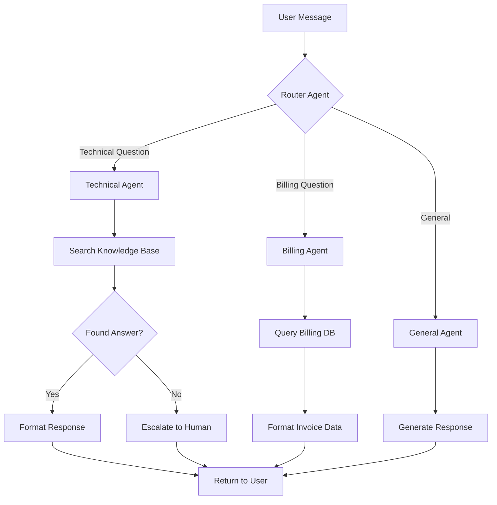

# Agent Architecture

Patterns, decision frameworks, and best practices for designing AI agent systems. Use this skill when the project type is `agent` or `hybrid`.

---

## Orchestration Patterns

### When to Use Each Pattern

| Pattern | Best For | Complexity | Example Use Case |
|---------|----------|-----------|------------------|
| **Single-turn** | Simple Q&A, classification, extraction | Low | FAQ bot, sentiment analysis, data extraction |
| **ReAct** | Tool-using tasks that need reasoning | Medium | Research assistant, data analysis agent |
| **Chain-of-thought** | Complex reasoning without tools | Medium | Math problems, logic puzzles, decision analysis |
| **Multi-agent router** | Multiple specialist domains | High | Customer support (billing + technical + sales agents) |
| **Multi-agent parallel** | Independent subtasks that can run simultaneously | High | Content pipeline (research + write + review in parallel) |
| **Plan-and-execute** | Multi-step tasks with dependencies | High | Project management bot, complex workflow automation |

### Pattern Details

#### Single-Turn
```
User Message → LLM → Response
```
- No loop, no tools, no memory beyond the conversation
- Use when: the task can be completed in one LLM call
- Cost: lowest (1 LLM call per interaction)

#### ReAct (Reason + Act)
```
User Message → LLM thinks → Calls tool → Observes result → LLM thinks → ... → Final response
```
- The agent reasons about what to do, takes an action (tool call), observes the result, and repeats until done
- Use when: the agent needs to gather information or take actions to answer
- Cost: 2-10 LLM calls per interaction (depends on task complexity)
- Most common pattern for production agents

#### Chain-of-Thought
```
User Message → LLM step 1 → LLM step 2 → ... → Final response
```
- Multi-step reasoning without external tools
- Use when: the task requires breaking down a complex problem
- Cost: 1-3 LLM calls (can often be done in a single call with prompting)

#### Multi-Agent Router
```
User Message → Router Agent → Specialist Agent A or B or C → Response
```
- A router agent classifies the request and dispatches to the right specialist
- Each specialist has its own tools, system prompt, and expertise
- Use when: you have distinct domains that require different knowledge
- Cost: 2+ LLM calls (router + specialist)

#### Multi-Agent Parallel
```
User Message → Coordinator → [Agent A, Agent B, Agent C] (parallel) → Merger → Response
```
- Multiple agents work on different aspects simultaneously
- A merger combines results
- Use when: subtasks are independent and speed matters
- Cost: highest (N agents + coordinator + merger)

#### Plan-and-Execute
```
User Message → Planner creates step list → Executor runs step 1 → ... → step N → Response
```
- A planner creates an explicit plan, then an executor works through each step
- Allows for re-planning if a step fails
- Use when: the task has clear sequential dependencies
- Cost: 2-10+ LLM calls

---

## Tool Design

### Tool Schema Pattern

Every agent tool should follow this structure:

```
Tool:
  name: descriptive-verb-noun (e.g., "search-knowledge-base", "create-ticket")
  type: <agent_tool_type>
  description: What it does in one sentence
  input:
    - parameter: name
      type: string | number | boolean | object
      required: true | false
      description: What this parameter controls
  output:
    - field: name
      type: string | number | object | array
      description: What this field contains
  errors:
    - error: name
      description: When this error occurs
```

### Tool Design Rules

1. **One tool, one job** — a tool should do exactly one thing
2. **Descriptive names** — `search-products` not `tool1`, `create-user` not `do-thing`
3. **Validate inputs** — the tool should fail gracefully with a clear error message
4. **Return structured data** — tools should return JSON objects, not prose
5. **Include error cases** — define what happens when the tool fails
6. **Limit scope** — a database query tool should not also format the results for display

### Common Tool Types

| Tool | Purpose | Input | Output |
|------|---------|-------|--------|
| `search-knowledge-base` | Find relevant documents | query string, top_k | Array of {document, score} |
| `query-database` | Execute a database query | collection, filter, fields | Array of documents |
| `call-api` | Make an HTTP request | url, method, headers, body | Response body + status |
| `create-record` | Insert data | collection, data | Created record ID |
| `update-record` | Modify data | collection, id, updates | Updated record |
| `send-notification` | Notify user/system | channel, recipient, message | Delivery status |
| `generate-content` | Create text/images | prompt, format, constraints | Generated content |
| `human-handoff` | Escalate to human | reason, context, priority | Handoff confirmation |

---

## Memory Strategies

| Strategy | When to Use | Implementation | Cost Impact |
|----------|-------------|----------------|-------------|
| **Session** | Short conversations, stateless tasks | Include last N messages in context | Low — bounded context |
| **Persistent** | Multi-session relationships, user preferences | Store in database, load relevant history | Medium — database reads |
| **Vector Store** | Large knowledge bases, semantic retrieval | Embed documents, retrieve top-K similar | Medium-High — embedding + storage costs |
| **Hybrid** | Complex agents needing both history and knowledge | Session memory + vector retrieval | High — multiple systems |

### Memory Selection Guide

- **Session only**: The agent doesn't need to remember past conversations. Each interaction starts fresh. Most agents start here.
- **Persistent**: The agent needs to remember user preferences, past decisions, or ongoing projects. Store in PostgreSQL or MongoDB.
- **Vector store**: The agent needs to search a large body of documents (help articles, product docs, codebases). Use Pinecone, Weaviate, or pgvector.
- **Hybrid**: The agent needs both conversation history AND document search. Combine persistent + vector.

---

## Guardrails

Every agent needs explicit guardrails. Define these in the system prompt and enforce them in the orchestration layer.

### Standard Guardrails

1. **Identity disclosure**: "Always acknowledge you are an AI when asked directly"
2. **Scope boundaries**: "Only answer questions related to [domain]. For out-of-scope questions, say: I can help with X, but for Y you should contact Z"
3. **No harmful actions**: "Never delete user data, send unauthorized messages, or make financial transactions without explicit user confirmation"
4. **Escalation triggers**: "Escalate to a human when: user is frustrated, topic is sensitive, confidence is low, legal/medical/financial advice is requested"
5. **Data handling**: "Never log or store: passwords, credit card numbers, SSNs, health records"
6. **Rate limits**: "Maximum N tool calls per conversation to prevent runaway loops"

### Guardrail Documentation Pattern

For each guardrail, document:

```
Guardrail: [Name]
  Trigger: When does this guardrail activate?
  Action: What does the agent do?
  Message: What does the agent say to the user?
  Fallback: What happens if the guardrail can't be enforced?
```

---

## Token Cost Modeling

### Estimation Method

1. **System prompt tokens**: Count tokens in system prompt (typically 500-2,000)
2. **Context tokens per turn**: Average input tokens = system prompt + conversation history + tool results
3. **Output tokens per turn**: Average output tokens = agent reasoning + tool calls + final response
4. **Turns per conversation**: How many agent turns per conversation (1 for single-turn, 3-8 for ReAct)
5. **Conversations per month**: Estimated usage volume

### Formula

```
Monthly cost = conversations/mo × turns/conversation × (input_tokens × input_price + output_tokens × output_price)
```

### Quick Reference Costs

| Pattern | Avg Turns | Avg Input Tokens | Avg Output Tokens | Cost per Conversation (Sonnet) |
|---------|-----------|-----------------|-------------------|-------------------------------|
| Single-turn | 1 | 1,500 | 500 | ~$0.01 |
| ReAct (simple) | 3 | 3,000 | 1,500 | ~$0.03 |
| ReAct (complex) | 7 | 8,000 | 3,000 | ~$0.07 |
| Multi-agent router | 3 | 4,000 | 2,000 | ~$0.04 |
| Plan-and-execute | 8 | 10,000 | 5,000 | ~$0.11 |

### Cost Optimization Tips

1. **Use the cheapest model that works** — start with Haiku/GPT-4o-mini, upgrade only if quality is insufficient
2. **Cache system prompts** — most providers offer prompt caching for repeated system prompts
3. **Trim conversation history** — summarize old messages instead of including full history
4. **Route by complexity** — use cheap model for simple queries, expensive model for complex ones
5. **Batch tool calls** — call multiple tools in one turn when possible
6. **Set max turn limits** — prevent runaway loops that burn tokens

---

## LLM Provider Selection

| Provider | Best For | Strengths | Weaknesses |
|----------|----------|-----------|------------|
| **Anthropic (Claude)** | Tool use, long context, safety | Best tool use, 200K context, strong guardrails | Higher cost at Opus tier |
| **OpenAI (GPT-4o)** | General purpose, ecosystem | Huge ecosystem, function calling, vision | Slightly weaker at complex reasoning vs Opus |
| **Google (Gemini)** | Long context, multimodal | 1M+ context window, good vision | Smaller ecosystem |
| **Mistral** | EU data residency, multilingual | Strong European language support, fast | Smaller model selection |
| **Groq** | Speed-critical applications | Ultra-fast inference | Limited model selection |
| **Local (Ollama)** | Privacy, offline, cost control | No API costs, full data control | Requires GPU, lower quality |

### Selection Decision Tree

1. **Need best tool use?** → Anthropic Claude
2. **Need largest ecosystem / most libraries?** → OpenAI
3. **Need longest context window?** → Google Gemini
4. **Need EU data residency?** → Mistral
5. **Need lowest latency?** → Groq
6. **Need full data privacy?** → Local (Ollama)
7. **Need cheapest at scale?** → Compare Haiku vs GPT-4o-mini vs Gemini Flash

---

## Implementation Guidance

**When designing agent architecture, provide comprehensive specifications:**

### 1. Agent Flow Diagram (REQUIRED)

**Always provide a visual flow diagram showing:**
- User input entry point
- Agent reasoning steps
- Tool calls and their sequence
- Decision points and branching logic
- Final output format

**Format (use Mermaid):**



### 2. Detailed Agent Specification (REQUIRED for each agent)

**For each agent in the system, provide:**

```markdown
Agent: [Agent Name]

Purpose:
[1-2 sentences describing what this agent does and when it's invoked]

Pattern:
[Single-turn / ReAct / Multi-agent router / etc.]

System Prompt:
```
You are a [role] agent. Your job is to [specific task].

Guidelines:
- [Specific guideline 1]
- [Specific guideline 2]
- [Specific guideline 3]

Available tools:
1. tool-name-1: [when to use it]
2. tool-name-2: [when to use it]

Output format:
[Expected output structure]

Guardrails:
- [Specific restriction 1]
- [Specific restriction 2]
```

Tools Available:
| Tool Name | Purpose | When to Use |
|-----------|---------|-------------|
| tool-1 | [Brief description] | [Trigger condition] |
| tool-2 | [Brief description] | [Trigger condition] |

Memory Configuration:
- Type: [Session / Persistent / Vector / Hybrid]
- Storage: [Where data is stored]
- Retention: [How long data is kept]
- Load strategy: [When/how to load memory]

Expected Input:
```json
{
  "user_message": "string",
  "conversation_id": "string",
  "user_context": {
    "user_id": "string",
    "preferences": {}
  }
}
```

Expected Output:
```json
{
  "response": "string",
  "confidence": 0.0-1.0,
  "sources": ["source1", "source2"],
  "needs_escalation": boolean,
  "metadata": {}
}
```

Error Handling:
| Error Type | Trigger | Action | User Message |
|------------|---------|--------|--------------|
| Tool failure | API returns 500 | Retry 3x with backoff | "I'm having trouble accessing [system]. Please try again." |
| Low confidence | confidence < 0.7 | Escalate to human | "I'm not confident in my answer. Let me connect you with a specialist." |
| Out of scope | Topic outside domain | Redirect | "I specialize in [domain]. For [other topic], please contact [resource]." |

Token Estimate:
- System prompt: ~X tokens
- Average input: ~Y tokens per turn
- Average output: ~Z tokens per turn
- Expected turns: A-B
- **Cost per conversation: $X - $Y (using [model name])**

Performance Targets:
- Response time: <X seconds (p95)
- Tool call latency: <Y seconds per tool
- Success rate: >Z% conversations resolved without escalation
```

### 3. Tool Implementation Specs (REQUIRED for each tool)

**For each custom tool, provide complete specification:**

```markdown
Tool: [tool-name]

Type: [API call / Database query / Function / External service]

Description:
[2-3 sentences on what this tool does and why it exists]

Input Schema:
```typescript
interface ToolInput {
  param1: string;  // Description of param1
  param2?: number; // Optional: Description of param2
  param3: {        // Nested object
    field1: string;
    field2: boolean;
  };
}
```

Output Schema:
```typescript
interface ToolOutput {
  success: boolean;
  data?: {
    // Success case structure
  };
  error?: {
    code: string;
    message: string;
  };
}
```

Implementation:
[Detailed description of how the tool works internally]

External Dependencies:
- Service: [Name of external service, if any]
- API endpoint: [Specific endpoint URL pattern]
- Authentication: [How to authenticate]
- Rate limits: [X requests per Y time period]

Error Cases:
| Error | Trigger | Code | Message | Retry? |
|-------|---------|------|---------|--------|
| [Error name] | [When it happens] | ERROR_CODE | "User-friendly message" | Yes/No |

Example Usage:
```json
Input:
{
  "param1": "example value",
  "param3": {
    "field1": "test",
    "field2": true
  }
}

Output (Success):
{
  "success": true,
  "data": {
    "result": "example result"
  }
}

Output (Failure):
{
  "success": false,
  "error": {
    "code": "INVALID_INPUT",
    "message": "param1 must not be empty"
  }
}
```

Performance:
- Average latency: X ms
- p95 latency: Y ms
- Timeout: Z ms
- Cost: $X per call (if applicable)

Testing Notes:
- Test case 1: [Description of what to test]
- Test case 2: [Description of what to test]
- Edge case 1: [Description of edge case]
```

### 4. Memory Architecture Specification (REQUIRED if using memory)

**Provide detailed memory implementation:**

```markdown
Memory Strategy: [Session / Persistent / Vector / Hybrid]

Storage Backend:
- Technology: [PostgreSQL / MongoDB / Pinecone / Redis]
- Connection: [How to connect]
- Schema: [Data structure]

Session Memory (if applicable):
- Window size: Last N messages
- Summarization: After M messages, summarize older messages
- Retention: Until session ends (X minutes of inactivity)

Persistent Memory (if applicable):
Database Schema:
```sql
CREATE TABLE conversations (
  id UUID PRIMARY KEY,
  user_id UUID NOT NULL,
  created_at TIMESTAMP,
  last_message_at TIMESTAMP,
  summary TEXT,
  metadata JSONB
);

CREATE TABLE messages (
  id UUID PRIMARY KEY,
  conversation_id UUID REFERENCES conversations(id),
  role VARCHAR(50), -- 'user' or 'assistant'
  content TEXT,
  tokens INTEGER,
  created_at TIMESTAMP
);
```

Load Strategy:
1. When conversation starts: [What to load]
2. During conversation: [What to load when]
3. Summarization trigger: [When to summarize old messages]

Vector Memory (if applicable):
- Embedding model: [Model name, dimension]
- Vector database: [Pinecone / Weaviate / pgvector]
- Index configuration: [Settings]
- Retrieval strategy: Top-K with threshold
  - K: [number]
  - Similarity threshold: [0.0-1.0]
  - Re-ranking: [Yes/No, if yes how]

Chunk Strategy (for document embeddings):
- Chunk size: X tokens
- Overlap: Y tokens
- Metadata attached: [List fields included with each chunk]

Cost Impact:
- Embedding cost: $X per 1M tokens
- Storage cost: $Y per GB per month
- Query cost: $Z per 1K queries
- **Expected monthly cost: $A - $B based on C users**

Privacy Considerations:
- PII handling: [How PII is handled]
- Data retention: [How long data is kept]
- Deletion process: [How users can delete their data]
- Encryption: [At rest / in transit]
```

### 5. Guardrail Implementation (REQUIRED)

**For each guardrail, provide enforceable specification:**

```markdown
Guardrail: [Name]

Priority: [Critical / High / Medium / Low]

Trigger:
[Specific, measurable condition that activates this guardrail]

Detection Method:
[How the system detects the trigger — pattern matching, classifier, heuristic, etc.]

Action:
1. [First action taken by system]
2. [Second action taken by system]
3. [Final outcome]

User Message:
```
[Exact message shown to user when guardrail activates]
```

Bypass Conditions:
[When is it OK to bypass this guardrail? Usually: "Never" or very specific exception]

Logging:
- Log event: Yes/No
- Alert team: Yes/No
- Include in analytics: Yes/No

Example:
User input: "[Example input that triggers guardrail]"
System detects: [What pattern/condition is detected]
System action: [What the system does]
User sees: "[Message shown]"

Testing:
- Test case 1: [Input that SHOULD trigger guardrail]
- Test case 2: [Input that should NOT trigger guardrail]
- Edge case: [Tricky input to test boundary]
```

### 6. Cost Breakdown and Optimization (ALWAYS include)

**Provide detailed token and cost analysis:**

```markdown
Agent Cost Analysis

Model: [Selected LLM model and tier]
Pricing: Input $X / MTok, Output $Y / MTok

Token Breakdown (per conversation):
| Component | Tokens | Cost |
|-----------|--------|------|
| System prompt | X | $X.XX |
| Average user message | X | $X.XX |
| Average agent response | X | $X.XX |
| Tool results | X | $X.XX |
| Context/memory | X | $X.XX |
| **Total per turn** | **X** | **$X.XX** |

Turns per conversation:
- Simple queries: A turns = $X
- Medium complexity: B turns = $Y
- Complex queries: C turns = $Z
- **Average: D turns = $W**

Monthly projection:
| Usage Level | Conversations/mo | Cost/mo |
|-------------|:----------------:|:-------:|
| Low | 1,000 | $X |
| Medium | 10,000 | $Y |
| High | 100,000 | $Z |

Cost Optimization Strategies:

✅ Strategy #1: [Name]
- Current cost: $X per conversation
- Optimized cost: $Y per conversation
- Savings: Z%
- How: [Specific implementation]
- Trade-off: [What you lose, if anything]

✅ Strategy #2: [Name]
- Current cost: $X per conversation
- Optimized cost: $Y per conversation
- Savings: Z%
- How: [Specific implementation]
- Trade-off: [What you lose, if anything]

[Continue for 3-5 strategies...]

Recommended optimization path:
1. [Start with this optimization — easiest/highest impact]
2. [Then this one]
3. [Finally this one if needed]

Cost with all optimizations:
- Before: $X per conversation
- After: $Y per conversation
- Savings: Z% ($W/month at medium usage)
```

### 7. Testing Strategy (REQUIRED)

**Provide comprehensive testing plan:**

```markdown
Agent Testing Plan

Unit Tests (per tool):
| Tool | Test Case | Expected Output | Edge Cases |
|------|-----------|----------------|------------|
| tool-1 | [Normal input] | [Expected result] | [3-5 edge cases to test] |
| tool-2 | [Normal input] | [Expected result] | [3-5 edge cases to test] |

Integration Tests (agent workflows):
1. **Happy path test**: [Describe complete successful flow]
   - Input: [User message]
   - Expected: Agent uses [tools], returns [response]
   - Success criteria: [Measurable criteria]

2. **Tool failure test**: [Describe tool failure scenario]
   - Input: [User message]
   - Failure: [Which tool fails and how]
   - Expected: Agent gracefully handles, returns [response]
   - Success criteria: [No crash, appropriate fallback]

3. **Guardrail test**: [Describe guardrail trigger]
   - Input: [User message that should trigger guardrail]
   - Expected: Guardrail activates, agent [action]
   - Success criteria: [Specific guardrail behavior]

4. **Multi-turn conversation test**: [Describe conversation flow]
   - Turn 1: [User message] → [Agent response]
   - Turn 2: [User message] → [Agent response]
   - Turn 3: [User message] → [Agent response]
   - Success criteria: [Agent maintains context, proper memory usage]

Evaluation Metrics:
| Metric | Target | How to Measure |
|--------|--------|----------------|
| Success rate | >X% | % conversations that resolve without escalation |
| Average response time | <Y sec | p95 latency from user message to response |
| Tool call accuracy | >Z% | % of tool calls that return successful results |
| User satisfaction | >W rating | Post-conversation survey (1-5 scale) |
| Cost per conversation | <$X | Track actual token usage vs estimate |

Red Team Tests (adversarial):
1. **Jailbreak attempt**: [Try to make agent ignore guardrails]
2. **Infinite loop attempt**: [Try to make agent loop forever]
3. **PII extraction**: [Try to make agent reveal sensitive data]
4. **Out-of-scope task**: [Request something agent shouldn't do]
5. **Ambiguous input**: [Intentionally vague or unclear request]

Testing Timeline:
- Unit tests: Complete before integration
- Integration tests: Complete before user testing
- Evaluation metrics: Track from beta launch onwards
- Red team tests: Run monthly or after major changes
```

### 8. Deployment and Monitoring (REQUIRED)

**Provide production readiness checklist:**

```markdown
Production Deployment Checklist

Pre-Launch:
- [ ] All tools tested with success/failure cases
- [ ] Guardrails validated with red team tests
- [ ] Cost per conversation confirmed within budget
- [ ] Response time meets p95 target (<X sec)
- [ ] Error handling tested (all tools can fail gracefully)
- [ ] Memory/persistence layer load tested
- [ ] Rate limiting configured (per user and global)
- [ ] Monitoring and logging configured
- [ ] Escalation workflow tested (human handoff works)
- [ ] Documentation complete (runbook, system prompt, tool specs)

Monitoring Setup:
| Metric | Tool | Alert Threshold | Action |
|--------|------|-----------------|--------|
| Error rate | [Sentry/Datadog] | >X% in 5 min | Page on-call engineer |
| Response time | [Monitoring tool] | p95 >Y sec | Investigate slow tools |
| Cost per conversation | [Custom dashboard] | >$Z | Review recent conversations |
| Tool call failures | [Logging] | >W% for any tool | Check external service status |
| Escalation rate | [Analytics] | >X% | Review agent quality |

Logging Requirements:
```json
{
  "conversation_id": "uuid",
  "timestamp": "ISO 8601",
  "user_id": "hashed_user_id",
  "agent_name": "string",
  "turn": 1,
  "action": "tool_call | response | escalation",
  "tool_name": "string | null",
  "latency_ms": 123,
  "tokens_used": {
    "input": 1234,
    "output": 567
  },
  "cost": 0.045,
  "confidence": 0.85,
  "error": null
}
```

Incident Response:
1. **High error rate detected**
   - Check: External service status (API status pages)
   - Action: Switch to degraded mode if service down
   - Communicate: Update status page for users

2. **Slow response times**
   - Check: Which tool is slow (latency logs)
   - Action: Increase timeout, implement caching, or disable tool temporarily
   - Communicate: Notify users of slower responses if needed

3. **Cost spike**
   - Check: Recent conversations for anomalies (infinite loops, very long contexts)
   - Action: Reduce max turns, implement stricter rate limiting
   - Communicate: Internal alert to team

4. **Guardrail breach**
   - Check: Logs for how the breach occurred
   - Action: Update system prompt and guardrail logic
   - Communicate: Security team if PII or harmful content involved

Runbook Location: [Link to detailed runbook]
On-Call Rotation: [How to contact on-call engineer]
```
