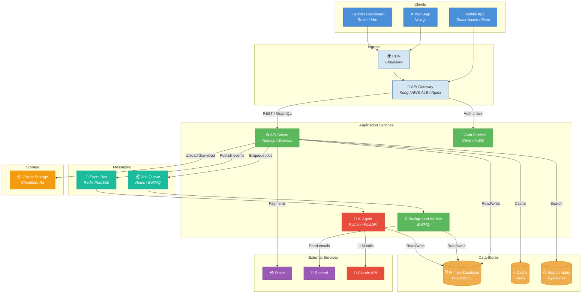
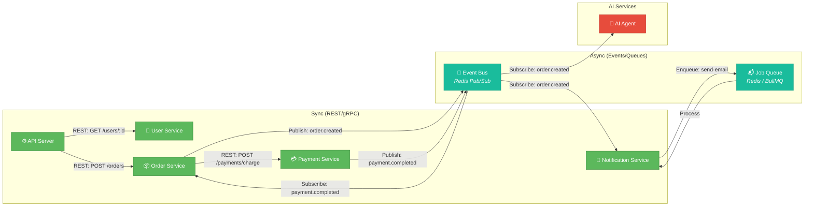
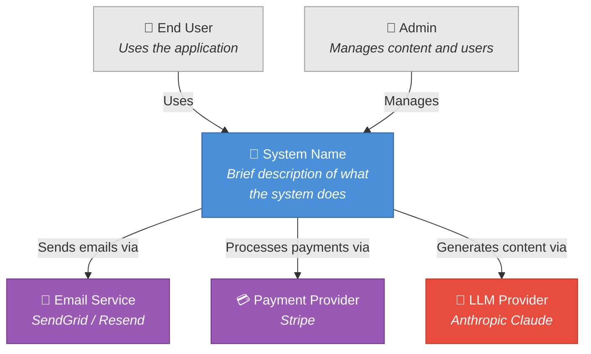
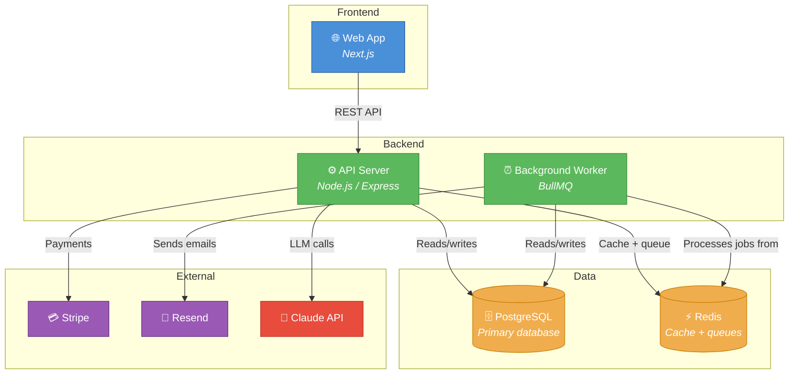
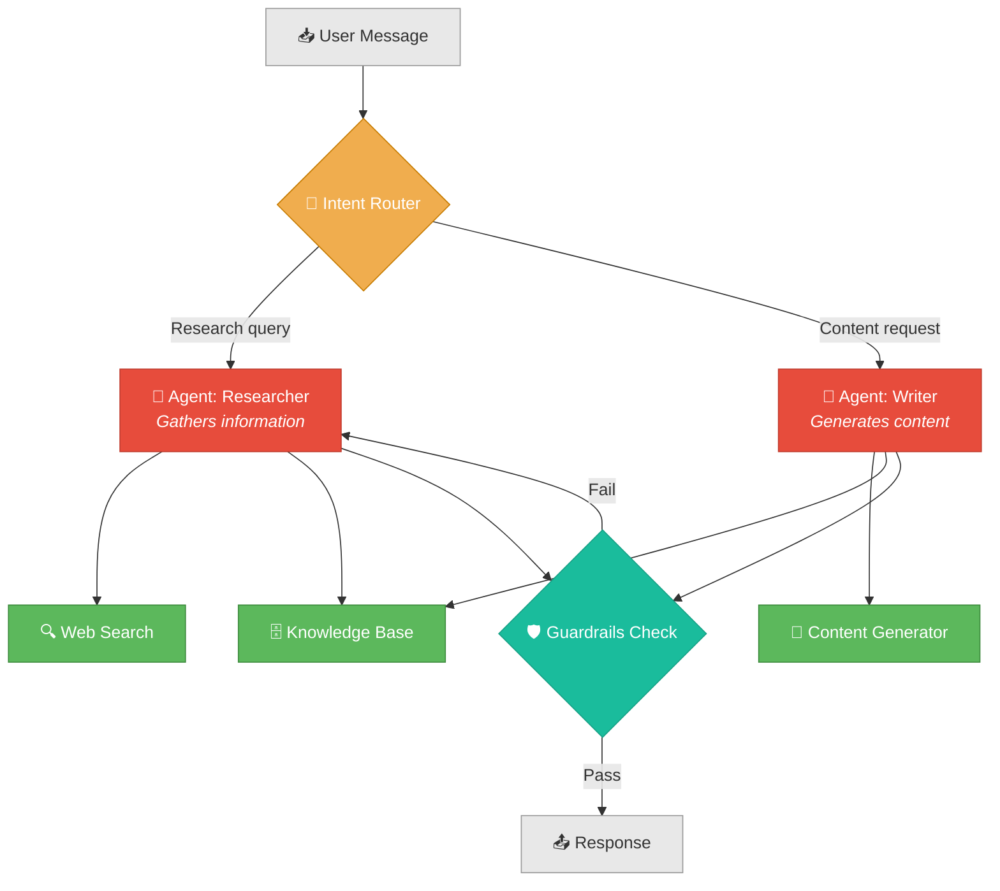
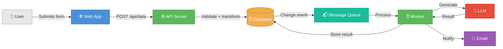
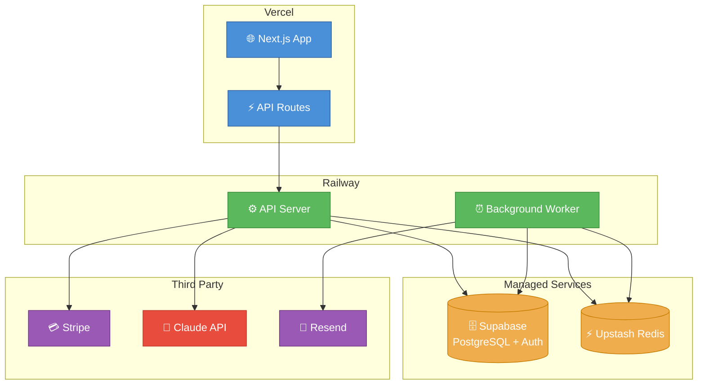
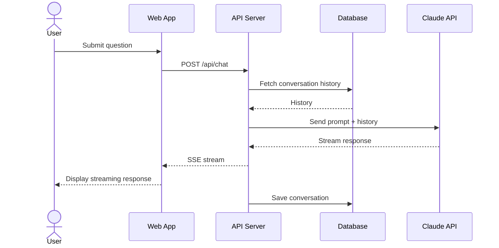
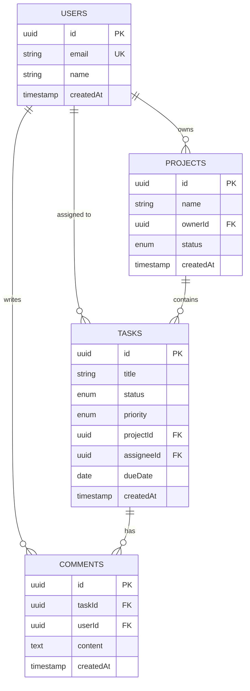
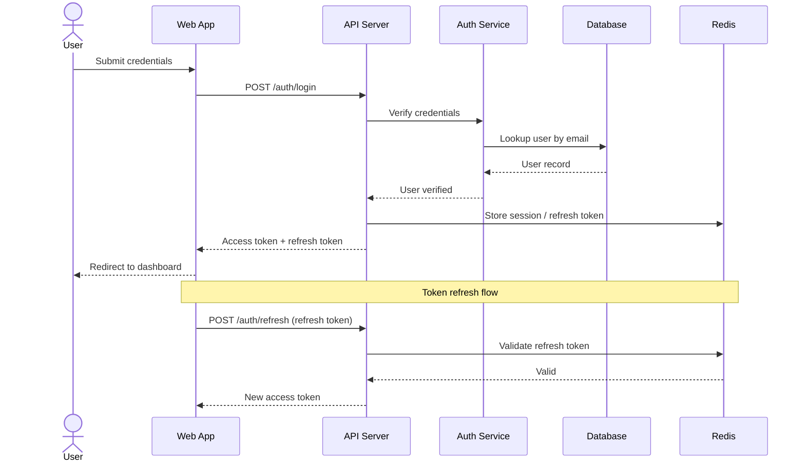

# Diagram Patterns

Guidelines and templates for generating consistent, readable architecture diagrams using Mermaid syntax. All diagrams in this plugin use Mermaid — never ASCII art.

---

## Canonical Diagram Set

**All diagrams live in `architecture-output/diagrams/` with these exact filenames.**
Every command that generates or exports diagrams reads from and writes to this single folder.

### Always Generated (every project)

| Filename | Purpose | Mermaid Type |
|----------|---------|--------------|
| `solution-architecture.mmd` | Full system topology — clients, ingress, services, queues, databases, external integrations | `graph TB` |
| `deployment.mmd` | Where each component runs — cloud provider, service tier, region, network boundaries | `graph TB` |
| `sequence-auth.mmd` | Authentication and session flow — login → token → API → refresh | `sequenceDiagram` |

### Generated When Condition Is Met

| Filename | Condition | Mermaid Type |
|----------|-----------|--------------|
| `er-diagram.mmd` | System has a relational database | `erDiagram` |
| `service-communication.mmd` | 2+ backend services or modular-monolith with 3+ modules | `graph LR` |
| `agent-flow.mmd` | System has AI agents or LLM orchestration | `graph TD` |
| `sequence-payment.mmd` | System has payment processing | `sequenceDiagram` |
| `data-flow.mmd` | Complex data pipeline or ETL (not just CRUD) | `graph LR` |

### Rules for All Diagrams

- **Output folder**: always `architecture-output/diagrams/<filename>.mmd`
- **Hard limit**: max 12 nodes per diagram — split into additional files if needed, never cram more in
- **Labels**: ≤ 5 words per node, technology on a second line with ` <i>Tech</i>`
- **Arrows**: every arrow must have a label (protocol, event name, or purpose)
- **Types**: use `graph TB/LR/TD`, `sequenceDiagram`, or `erDiagram` only — **never** `C4Context`, `C4Container`, `C4Component`, or any other C4 Mermaid type
- **No nested blocks**: never write `keyword(...) {` — all node declarations are flat at diagram scope

---

## Diagram Types

| Diagram | When to Use | Mermaid Type |
|---------|-------------|-------------|
| Solution Architecture | Show the full system topology: clients, API gateway, services, queues, databases, storage, external APIs | `graph TB` |
| Service Communication | Show how microservices/backend services connect to each other with protocols and patterns | `graph LR` |
| ER Diagram | Show database entities, their fields, and relationships | `erDiagram` |
| Data Flow | Show how data moves through the system | `graph LR` |
| Agent Flow | Show AI agent orchestration and tool usage | `graph TD` |
| Deployment | Show where components run | `graph TB` |
| Sequence | Show interaction between components over time | `sequenceDiagram` |

---

## Color Conventions

Use consistent colors across all diagrams:

| Component Type | Color | Mermaid Style |
|---------------|-------|---------------|
| User / Actor | Grey | `style ... fill:#e8e8e8,stroke:#999` |
| Frontend | Blue | `style ... fill:#4a90d9,stroke:#2c5ea0,color:#fff` |
| Backend Service | Green | `style ... fill:#5cb85c,stroke:#3d8b3d,color:#fff` |
| Database | Orange | `style ... fill:#f0ad4e,stroke:#c77c00,color:#fff` |
| External Service | Purple | `style ... fill:#9b59b6,stroke:#6c3483,color:#fff` |
| AI Agent / LLM | Red/Pink | `style ... fill:#e74c3c,stroke:#c0392b,color:#fff` |
| Message Queue | Teal | `style ... fill:#1abc9c,stroke:#16a085,color:#fff` |

---

## Solution Architecture Diagram

Shows the full system topology from clients to infrastructure. Always generated for every blueprint. This is the primary "big picture" diagram that non-technical stakeholders see first.

Include all layers: clients (web, mobile), ingress (API gateway, CDN, load balancer), application services (APIs, workers, agents), messaging (queues, event bus), data (databases, cache, search), storage (file/object storage), and external integrations.

```mermaid
graph TB
    subgraph "Clients"
        WebApp["🌐 Web App<br/><i>Next.js</i>"]
        MobileApp["📱 Mobile App<br/><i>React Native / Expo</i>"]
        AdminApp["🔧 Admin Dashboard<br/><i>React / Vite</i>"]
    end

    subgraph "Ingress"
        CDN["🌍 CDN<br/><i>Cloudflare</i>"]
        Gateway["🚪 API Gateway<br/><i>Kong / AWS ALB / Nginx</i>"]
    end

    subgraph "Application Services"
        API["⚙️ API Server<br/><i>Node.js / Express</i>"]
        AuthService["🔐 Auth Service<br/><i>Clerk / Auth0</i>"]
        Worker["⏰ Background Worker<br/><i>BullMQ</i>"]
        Agent["🤖 AI Agent<br/><i>Python / FastAPI</i>"]
    end

    subgraph "Messaging"
        Queue["📬 Job Queue<br/><i>Redis / BullMQ</i>"]
        EventBus["📡 Event Bus<br/><i>Redis Pub/Sub</i>"]
    end

    subgraph "Data Stores"
        DB[("🗄️ Primary Database<br/><i>PostgreSQL</i>")]
        Cache[("⚡ Cache<br/><i>Redis</i>")]
        Search[("🔍 Search Index<br/><i>Typesense</i>")]
    end

    subgraph "Storage"
        ObjectStore["📦 Object Storage<br/><i>Cloudflare R2</i>"]
    end

    subgraph "External Services"
        Stripe["💳 Stripe"]
        Resend["📧 Resend"]
        Claude["🤖 Claude API"]
    end

    WebApp --> CDN
    MobileApp --> Gateway
    AdminApp --> CDN
    CDN --> Gateway
    Gateway -->|"REST / GraphQL"| API
    Gateway -->|"Auth check"| AuthService
    API -->|"Read/write"| DB
    API -->|"Cache"| Cache
    API -->|"Enqueue jobs"| Queue
    API -->|"Publish events"| EventBus
    API -->|"Search"| Search
    API -->|"Upload/download"| ObjectStore
    API -->|"Payments"| Stripe
    Queue --> Worker
    Worker -->|"Read/write"| DB
    Worker -->|"Send emails"| Resend
    EventBus --> Agent
    Agent -->|"LLM calls"| Claude
    Agent -->|"Read/write"| DB

    style WebApp fill:#4a90d9,stroke:#2c5ea0,color:#fff
    style MobileApp fill:#4a90d9,stroke:#2c5ea0,color:#fff
    style AdminApp fill:#4a90d9,stroke:#2c5ea0,color:#fff
    style CDN fill:#d4e6f1,stroke:#2c5ea0
    style Gateway fill:#d4e6f1,stroke:#2c5ea0
    style API fill:#5cb85c,stroke:#3d8b3d,color:#fff
    style AuthService fill:#5cb85c,stroke:#3d8b3d,color:#fff
    style Worker fill:#5cb85c,stroke:#3d8b3d,color:#fff
    style Agent fill:#e74c3c,stroke:#c0392b,color:#fff
    style Queue fill:#1abc9c,stroke:#16a085,color:#fff
    style EventBus fill:#1abc9c,stroke:#16a085,color:#fff
    style DB fill:#f0ad4e,stroke:#c77c00,color:#fff
    style Cache fill:#f0ad4e,stroke:#c77c00,color:#fff
    style Search fill:#f0ad4e,stroke:#c77c00,color:#fff
    style ObjectStore fill:#f39c12,stroke:#d68910,color:#fff
    style Stripe fill:#9b59b6,stroke:#6c3483,color:#fff
    style Resend fill:#9b59b6,stroke:#6c3483,color:#fff
    style Claude fill:#e74c3c,stroke:#c0392b,color:#fff
```

**Adaptation rules:**
- Remove layers that don't exist (e.g., no CDN for internal tools, no Agent layer if no AI)
- Add layers as needed (e.g., add "Real-time" subgraph with WebSocket server if the system has real-time features)
- If no API gateway, connect clients directly to services
- If monolith, show a single service box instead of multiple
- Always label arrows with the protocol or purpose
- For simple systems (1 frontend, 1 API, 1 database), collapse into fewer subgraphs but keep the same topology style

**Additional color conventions for Solution Architecture:**

| Component Type | Color | Mermaid Style |
|---------------|-------|---------------|
| Ingress / Gateway / CDN | Light blue | `style ... fill:#d4e6f1,stroke:#2c5ea0` |
| Object / File Storage | Dark orange | `style ... fill:#f39c12,stroke:#d68910,color:#fff` |

---

## Service Communication Diagram

Shows how backend services, workers, and agents communicate with each other. Generated when the system has 2+ backend services. Focuses on inter-service protocols, sync vs async patterns, and data ownership boundaries.

```mermaid
graph LR
    subgraph "Sync (REST/gRPC)"
        API["⚙️ API Server"]
        UserSvc["👤 User Service"]
        OrderSvc["📦 Order Service"]
        PaymentSvc["💳 Payment Service"]
        NotifSvc["🔔 Notification Service"]
    end

    subgraph "Async (Events/Queues)"
        Queue["📬 Job Queue<br/><i>Redis / BullMQ</i>"]
        EventBus["📡 Event Bus<br/><i>Redis Pub/Sub</i>"]
    end

    subgraph "AI Services"
        Agent["🤖 AI Agent"]
    end

    API -->|"REST: GET /users/:id"| UserSvc
    API -->|"REST: POST /orders"| OrderSvc
    OrderSvc -->|"REST: POST /payments/charge"| PaymentSvc
    OrderSvc -->|"Publish: order.created"| EventBus
    EventBus -->|"Subscribe: order.created"| NotifSvc
    EventBus -->|"Subscribe: order.created"| Agent
    PaymentSvc -->|"Publish: payment.completed"| EventBus
    EventBus -->|"Subscribe: payment.completed"| OrderSvc
    NotifSvc -->|"Enqueue: send-email"| Queue
    Queue -->|"Process"| NotifSvc

    style API fill:#5cb85c,stroke:#3d8b3d,color:#fff
    style UserSvc fill:#5cb85c,stroke:#3d8b3d,color:#fff
    style OrderSvc fill:#5cb85c,stroke:#3d8b3d,color:#fff
    style PaymentSvc fill:#5cb85c,stroke:#3d8b3d,color:#fff
    style NotifSvc fill:#5cb85c,stroke:#3d8b3d,color:#fff
    style Queue fill:#1abc9c,stroke:#16a085,color:#fff
    style EventBus fill:#1abc9c,stroke:#16a085,color:#fff
    style Agent fill:#e74c3c,stroke:#c0392b,color:#fff
```

**Adaptation rules:**
- Show ALL backend services from the manifest, not just core ones
- Label every arrow with the protocol AND the specific endpoint or event name
- Separate sync calls (solid arrows) from async events (dotted arrows where Mermaid supports it, or use different subgraph grouping)
- Group services by domain/bounded context if using modular-monolith or microservices
- Show which service owns which database (use dashed lines to data stores if helpful, but keep the focus on inter-service communication)
- For monolith with internal modules, show module-to-module function calls instead of HTTP/event patterns
- Include retry/circuit-breaker annotations on critical paths: `-->|"REST (retry: 3x, timeout: 5s)"| ServiceB`

**When to generate this diagram:**
- Always: when the system has 2+ backend services or a modular-monolith with 3+ modules
- Skip: for single-service systems (the Solution Architecture diagram is sufficient)

---

## C4 Context Diagram

Shows the system as a single box, with users and external systems around it.

```mermaid
graph TB
    User["👤 End User<br/><i>Uses the application</i>"]
    Admin["👤 Admin<br/><i>Manages content and users</i>"]

    System["🏢 System Name<br/><i>Brief description of what<br/>the system does</i>"]

    Email["📧 Email Service<br/><i>SendGrid / Resend</i>"]
    Payment["💳 Payment Provider<br/><i>Stripe</i>"]
    LLM["🤖 LLM Provider<br/><i>Anthropic Claude</i>"]

    User -->|"Uses"| System
    Admin -->|"Manages"| System
    System -->|"Sends emails via"| Email
    System -->|"Processes payments via"| Payment
    System -->|"Generates content via"| LLM

    style System fill:#4a90d9,stroke:#2c5ea0,color:#fff
    style User fill:#e8e8e8,stroke:#999
    style Admin fill:#e8e8e8,stroke:#999
    style Email fill:#9b59b6,stroke:#6c3483,color:#fff
    style Payment fill:#9b59b6,stroke:#6c3483,color:#fff
    style LLM fill:#e74c3c,stroke:#c0392b,color:#fff
```

---

## C4 Container Diagram

Shows the internal structure: frontends, services, databases, and their connections.

```mermaid
graph TB
    subgraph "Frontend"
        WebApp["🌐 Web App<br/><i>Next.js</i>"]
    end

    subgraph "Backend"
        API["⚙️ API Server<br/><i>Node.js / Express</i>"]
        Worker["⏰ Background Worker<br/><i>BullMQ</i>"]
    end

    subgraph "Data"
        DB[("🗄️ PostgreSQL<br/><i>Primary database</i>")]
        Cache[("⚡ Redis<br/><i>Cache + queues</i>")]
    end

    subgraph "External"
        Stripe["💳 Stripe"]
        Resend["📧 Resend"]
        Claude["🤖 Claude API"]
    end

    WebApp -->|"REST API"| API
    API -->|"Reads/writes"| DB
    API -->|"Cache + queue"| Cache
    Worker -->|"Processes jobs from"| Cache
    Worker -->|"Reads/writes"| DB
    API -->|"Payments"| Stripe
    Worker -->|"Sends emails"| Resend
    API -->|"LLM calls"| Claude

    style WebApp fill:#4a90d9,stroke:#2c5ea0,color:#fff
    style API fill:#5cb85c,stroke:#3d8b3d,color:#fff
    style Worker fill:#5cb85c,stroke:#3d8b3d,color:#fff
    style DB fill:#f0ad4e,stroke:#c77c00,color:#fff
    style Cache fill:#f0ad4e,stroke:#c77c00,color:#fff
    style Stripe fill:#9b59b6,stroke:#6c3483,color:#fff
    style Resend fill:#9b59b6,stroke:#6c3483,color:#fff
    style Claude fill:#e74c3c,stroke:#c0392b,color:#fff
```

---

## Agent Flow Diagram

Shows how an AI agent processes requests, uses tools, and returns results.

```mermaid
graph TD
    Input["📥 User Message"]
    Router{"🧭 Intent Router"}
    Agent1["🤖 Agent: Researcher<br/><i>Gathers information</i>"]
    Agent2["🤖 Agent: Writer<br/><i>Generates content</i>"]

    Tool1["🔍 Web Search"]
    Tool2["🗄️ Knowledge Base"]
    Tool3["📝 Content Generator"]

    Guardrails{"🛡️ Guardrails Check"}
    Output["📤 Response"]

    Input --> Router
    Router -->|"Research query"| Agent1
    Router -->|"Content request"| Agent2

    Agent1 --> Tool1
    Agent1 --> Tool2
    Agent1 --> Guardrails

    Agent2 --> Tool3
    Agent2 --> Tool2
    Agent2 --> Guardrails

    Guardrails -->|"Pass"| Output
    Guardrails -->|"Fail"| Agent1

    style Input fill:#e8e8e8,stroke:#999
    style Router fill:#f0ad4e,stroke:#c77c00,color:#fff
    style Agent1 fill:#e74c3c,stroke:#c0392b,color:#fff
    style Agent2 fill:#e74c3c,stroke:#c0392b,color:#fff
    style Tool1 fill:#5cb85c,stroke:#3d8b3d,color:#fff
    style Tool2 fill:#5cb85c,stroke:#3d8b3d,color:#fff
    style Tool3 fill:#5cb85c,stroke:#3d8b3d,color:#fff
    style Guardrails fill:#1abc9c,stroke:#16a085,color:#fff
    style Output fill:#e8e8e8,stroke:#999
```

---

## Data Flow Diagram

Shows how data moves through the system from input to storage to output.

```mermaid
graph LR
    User["👤 User"] -->|"Submits form"| WebApp
    WebApp["🌐 Web App"] -->|"POST /api/data"| API
    API["⚙️ API Server"] -->|"Validate + transform"| DB
    DB[("🗄️ Database")] -->|"Change event"| Queue
    Queue["📬 Message Queue"] -->|"Process"| Worker
    Worker["⏰ Worker"] -->|"Generate"| LLM
    LLM["🤖 LLM"] -->|"Result"| Worker
    Worker -->|"Store result"| DB
    Worker -->|"Notify"| Email["📧 Email"]

    style User fill:#e8e8e8,stroke:#999
    style WebApp fill:#4a90d9,stroke:#2c5ea0,color:#fff
    style API fill:#5cb85c,stroke:#3d8b3d,color:#fff
    style DB fill:#f0ad4e,stroke:#c77c00,color:#fff
    style Queue fill:#1abc9c,stroke:#16a085,color:#fff
    style Worker fill:#5cb85c,stroke:#3d8b3d,color:#fff
    style LLM fill:#e74c3c,stroke:#c0392b,color:#fff
    style Email fill:#9b59b6,stroke:#6c3483,color:#fff
```

---

## Deployment Diagram

Shows where each component is deployed.

```mermaid
graph TB
    subgraph "Vercel"
        Frontend["🌐 Next.js App"]
        Serverless["⚡ API Routes"]
    end

    subgraph "Railway"
        API["⚙️ API Server"]
        Worker["⏰ Background Worker"]
    end

    subgraph "Managed Services"
        Supabase[("🗄️ Supabase<br/>PostgreSQL + Auth")]
        Upstash[("⚡ Upstash Redis")]
    end

    subgraph "Third Party"
        Stripe["💳 Stripe"]
        Claude["🤖 Claude API"]
        Resend["📧 Resend"]
    end

    Frontend --> Serverless
    Serverless --> API
    API --> Supabase
    API --> Upstash
    API --> Stripe
    API --> Claude
    Worker --> Upstash
    Worker --> Supabase
    Worker --> Resend

    style Frontend fill:#4a90d9,stroke:#2c5ea0,color:#fff
    style Serverless fill:#4a90d9,stroke:#2c5ea0,color:#fff
    style API fill:#5cb85c,stroke:#3d8b3d,color:#fff
    style Worker fill:#5cb85c,stroke:#3d8b3d,color:#fff
    style Supabase fill:#f0ad4e,stroke:#c77c00,color:#fff
    style Upstash fill:#f0ad4e,stroke:#c77c00,color:#fff
    style Stripe fill:#9b59b6,stroke:#6c3483,color:#fff
    style Claude fill:#e74c3c,stroke:#c0392b,color:#fff
    style Resend fill:#9b59b6,stroke:#6c3483,color:#fff
```

---

## Sequence Diagram

Shows time-ordered interactions between components.

```mermaid
sequenceDiagram
    actor User
    participant Web as Web App
    participant API as API Server
    participant DB as Database
    participant LLM as Claude API

    User->>Web: Submit question
    Web->>API: POST /api/chat
    API->>DB: Fetch conversation history
    DB-->>API: History
    API->>LLM: Send prompt + history
    LLM-->>API: Stream response
    API-->>Web: SSE stream
    Web-->>User: Display streaming response
    API->>DB: Save conversation
```

---

## ER Diagram

Shows the database schema: entities, their key fields, and relationships. Generated whenever the system has a relational database.

Use `erDiagram` type. Include only the core domain entities (max 8) — omit lookup/config tables. Show the relationship cardinality and the foreign key name on each relationship line.

```mermaid
erDiagram
    USERS {
        uuid id PK
        string email UK
        string name
        timestamp createdAt
    }
    PROJECTS {
        uuid id PK
        string name
        uuid ownerId FK
        enum status
        timestamp createdAt
    }
    TASKS {
        uuid id PK
        string title
        enum status
        enum priority
        uuid projectId FK
        uuid assigneeId FK
        date dueDate
        timestamp createdAt
    }
    COMMENTS {
        uuid id PK
        uuid taskId FK
        uuid userId FK
        text content
        timestamp createdAt
    }

    USERS ||--o{ PROJECTS : "owns"
    USERS ||--o{ TASKS : "assigned to"
    USERS ||--o{ COMMENTS : "writes"
    PROJECTS ||--o{ TASKS : "contains"
    TASKS ||--o{ COMMENTS : "has"
```

**Adaptation rules:**
- Only show entities with direct relationships to core domain objects — omit audit logs, config tables, join tables unless they have their own meaningful fields
- List only the most important fields per entity (PK, FKs, status/type enums, 1-2 key data fields) — not every column
- Use standard cardinality notation: `||--o{` (one-to-many), `||--||` (one-to-one), `}o--o{` (many-to-many)

---

## Authentication Sequence

Shows the full auth flow. Always generated — every system has authentication.

```mermaid
sequenceDiagram
    actor User
    participant Web as Web App
    participant API as API Server
    participant Auth as Auth Service
    participant DB as Database
    participant Cache as Redis

    User->>Web: Submit credentials
    Web->>API: POST /auth/login
    API->>Auth: Verify credentials
    Auth->>DB: Lookup user by email
    DB-->>Auth: User record
    Auth-->>API: User verified
    API->>Cache: Store session / refresh token
    API-->>Web: Access token + refresh token
    Web-->>User: Redirect to dashboard

    Note over Web,Cache: Token refresh flow
    Web->>API: POST /auth/refresh (refresh token)
    API->>Cache: Validate refresh token
    Cache-->>API: Valid
    API-->>Web: New access token
```

**Adaptation rules:**
- If using OAuth/SSO (Clerk, Auth0, Google): replace `Auth Service` with the provider and show the redirect flow
- If using JWT only (no session store): remove the Cache step and show token validation inline in API
- Max 6 participants — collapse internal services if needed

---

## Diagram Rules

1. **Output location**: always write to `architecture-output/diagrams/<canonical-filename>.mmd` — never embed diagrams inside markdown files
2. **Hard node limit**: max 12 nodes per diagram — split into a second file rather than cramming more in
3. **Short labels**: ≤ 5 words per node label; technology on a second line with ` <i>Tech</i>`
4. **Label every arrow**: every connection must have a label (protocol, event name, or purpose) — unlabelled arrows are meaningless
5. **Use subgraphs** to group related components (Frontend, Backend, Data, External, Cloud regions)
6. **Use icons** in node labels for visual scanning: 🌐 web · ⚙️ service · 🗄️ database · 🤖 AI · 💳 payment · 📧 email · ⚡ cache · 📬 queue
7. **Show direction**: `graph TB` for hierarchy, `graph LR` for data/communication flows
8. **Include technology names**: "Next.js" not just "Web App", "PostgreSQL" not just "Database"
9. **NEVER use C4 Mermaid types**: no `C4Context`, `C4Container`, `C4Component`, `C4Dynamic`, `C4Deployment` — use `graph TB` with subgraphs instead
10. **No nested block syntax**: never write `Container(...) {` or any `keyword(...) {` block — all node declarations are flat
11. **Sequence diagrams**: max 6 participants, max 15 messages — show only the critical path
