# Diagram Patterns

Guidelines and templates for generating consistent, readable architecture diagrams using Mermaid syntax. All diagrams in this plugin use Mermaid — never ASCII art.

---

## Diagram Types

| Diagram | When to Use | Mermaid Type |
|---------|-------------|-------------|
| C4 Context | Show the system in relation to users and external systems | `graph TB` |
| C4 Container | Show internal containers (frontends, services, databases) | `graph TB` |
| Data Flow | Show how data moves through the system | `graph LR` |
| Agent Flow | Show AI agent orchestration and tool usage | `graph TD` |
| Deployment | Show where components run | `graph TB` |
| Sequence | Show interaction between components over time | `sequenceDiagram` |

---

## Color Conventions

Use consistent colors across all diagrams:

| Component Type | Color | Mermaid Style |
|---------------|-------|---------------|
| User / Actor | Grey | `style ... fill:#e8e8e8,stroke:#999` |
| Frontend | Blue | `style ... fill:#4a90d9,stroke:#2c5ea0,color:#fff` |
| Backend Service | Green | `style ... fill:#5cb85c,stroke:#3d8b3d,color:#fff` |
| Database | Orange | `style ... fill:#f0ad4e,stroke:#c77c00,color:#fff` |
| External Service | Purple | `style ... fill:#9b59b6,stroke:#6c3483,color:#fff` |
| AI Agent / LLM | Red/Pink | `style ... fill:#e74c3c,stroke:#c0392b,color:#fff` |
| Message Queue | Teal | `style ... fill:#1abc9c,stroke:#16a085,color:#fff` |

---

## C4 Context Diagram

Shows the system as a single box, with users and external systems around it.

```mermaid
graph TB
    User["👤 End User<br/><i>Uses the application</i>"]
    Admin["👤 Admin<br/><i>Manages content and users</i>"]

    System["🏢 System Name<br/><i>Brief description of what<br/>the system does</i>"]

    Email["📧 Email Service<br/><i>SendGrid / Resend</i>"]
    Payment["💳 Payment Provider<br/><i>Stripe</i>"]
    LLM["🤖 LLM Provider<br/><i>Anthropic Claude</i>"]

    User -->|"Uses"| System
    Admin -->|"Manages"| System
    System -->|"Sends emails via"| Email
    System -->|"Processes payments via"| Payment
    System -->|"Generates content via"| LLM

    style System fill:#4a90d9,stroke:#2c5ea0,color:#fff
    style User fill:#e8e8e8,stroke:#999
    style Admin fill:#e8e8e8,stroke:#999
    style Email fill:#9b59b6,stroke:#6c3483,color:#fff
    style Payment fill:#9b59b6,stroke:#6c3483,color:#fff
    style LLM fill:#e74c3c,stroke:#c0392b,color:#fff
```

---

## C4 Container Diagram

Shows the internal structure: frontends, services, databases, and their connections.

```mermaid
graph TB
    subgraph "Frontend"
        WebApp["🌐 Web App<br/><i>Next.js</i>"]
    end

    subgraph "Backend"
        API["⚙️ API Server<br/><i>Node.js / Express</i>"]
        Worker["⏰ Background Worker<br/><i>BullMQ</i>"]
    end

    subgraph "Data"
        DB[("🗄️ PostgreSQL<br/><i>Primary database</i>")]
        Cache[("⚡ Redis<br/><i>Cache + queues</i>")]
    end

    subgraph "External"
        Stripe["💳 Stripe"]
        Resend["📧 Resend"]
        Claude["🤖 Claude API"]
    end

    WebApp -->|"REST API"| API
    API -->|"Reads/writes"| DB
    API -->|"Cache + queue"| Cache
    Worker -->|"Processes jobs from"| Cache
    Worker -->|"Reads/writes"| DB
    API -->|"Payments"| Stripe
    Worker -->|"Sends emails"| Resend
    API -->|"LLM calls"| Claude

    style WebApp fill:#4a90d9,stroke:#2c5ea0,color:#fff
    style API fill:#5cb85c,stroke:#3d8b3d,color:#fff
    style Worker fill:#5cb85c,stroke:#3d8b3d,color:#fff
    style DB fill:#f0ad4e,stroke:#c77c00,color:#fff
    style Cache fill:#f0ad4e,stroke:#c77c00,color:#fff
    style Stripe fill:#9b59b6,stroke:#6c3483,color:#fff
    style Resend fill:#9b59b6,stroke:#6c3483,color:#fff
    style Claude fill:#e74c3c,stroke:#c0392b,color:#fff
```

---

## Agent Flow Diagram

Shows how an AI agent processes requests, uses tools, and returns results.

```mermaid
graph TD
    Input["📥 User Message"]
    Router{"🧭 Intent Router"}
    Agent1["🤖 Agent: Researcher<br/><i>Gathers information</i>"]
    Agent2["🤖 Agent: Writer<br/><i>Generates content</i>"]

    Tool1["🔍 Web Search"]
    Tool2["🗄️ Knowledge Base"]
    Tool3["📝 Content Generator"]

    Guardrails{"🛡️ Guardrails Check"}
    Output["📤 Response"]

    Input --> Router
    Router -->|"Research query"| Agent1
    Router -->|"Content request"| Agent2

    Agent1 --> Tool1
    Agent1 --> Tool2
    Agent1 --> Guardrails

    Agent2 --> Tool3
    Agent2 --> Tool2
    Agent2 --> Guardrails

    Guardrails -->|"Pass"| Output
    Guardrails -->|"Fail"| Agent1

    style Input fill:#e8e8e8,stroke:#999
    style Router fill:#f0ad4e,stroke:#c77c00,color:#fff
    style Agent1 fill:#e74c3c,stroke:#c0392b,color:#fff
    style Agent2 fill:#e74c3c,stroke:#c0392b,color:#fff
    style Tool1 fill:#5cb85c,stroke:#3d8b3d,color:#fff
    style Tool2 fill:#5cb85c,stroke:#3d8b3d,color:#fff
    style Tool3 fill:#5cb85c,stroke:#3d8b3d,color:#fff
    style Guardrails fill:#1abc9c,stroke:#16a085,color:#fff
    style Output fill:#e8e8e8,stroke:#999
```

---

## Data Flow Diagram

Shows how data moves through the system from input to storage to output.

```mermaid
graph LR
    User["👤 User"] -->|"Submits form"| WebApp
    WebApp["🌐 Web App"] -->|"POST /api/data"| API
    API["⚙️ API Server"] -->|"Validate + transform"| DB
    DB[("🗄️ Database")] -->|"Change event"| Queue
    Queue["📬 Message Queue"] -->|"Process"| Worker
    Worker["⏰ Worker"] -->|"Generate"| LLM
    LLM["🤖 LLM"] -->|"Result"| Worker
    Worker -->|"Store result"| DB
    Worker -->|"Notify"| Email["📧 Email"]

    style User fill:#e8e8e8,stroke:#999
    style WebApp fill:#4a90d9,stroke:#2c5ea0,color:#fff
    style API fill:#5cb85c,stroke:#3d8b3d,color:#fff
    style DB fill:#f0ad4e,stroke:#c77c00,color:#fff
    style Queue fill:#1abc9c,stroke:#16a085,color:#fff
    style Worker fill:#5cb85c,stroke:#3d8b3d,color:#fff
    style LLM fill:#e74c3c,stroke:#c0392b,color:#fff
    style Email fill:#9b59b6,stroke:#6c3483,color:#fff
```

---

## Deployment Diagram

Shows where each component is deployed.

```mermaid
graph TB
    subgraph "Vercel"
        Frontend["🌐 Next.js App"]
        Serverless["⚡ API Routes"]
    end

    subgraph "Railway"
        API["⚙️ API Server"]
        Worker["⏰ Background Worker"]
    end

    subgraph "Managed Services"
        Supabase[("🗄️ Supabase<br/>PostgreSQL + Auth")]
        Upstash[("⚡ Upstash Redis")]
    end

    subgraph "Third Party"
        Stripe["💳 Stripe"]
        Claude["🤖 Claude API"]
        Resend["📧 Resend"]
    end

    Frontend --> Serverless
    Serverless --> API
    API --> Supabase
    API --> Upstash
    API --> Stripe
    API --> Claude
    Worker --> Upstash
    Worker --> Supabase
    Worker --> Resend

    style Frontend fill:#4a90d9,stroke:#2c5ea0,color:#fff
    style Serverless fill:#4a90d9,stroke:#2c5ea0,color:#fff
    style API fill:#5cb85c,stroke:#3d8b3d,color:#fff
    style Worker fill:#5cb85c,stroke:#3d8b3d,color:#fff
    style Supabase fill:#f0ad4e,stroke:#c77c00,color:#fff
    style Upstash fill:#f0ad4e,stroke:#c77c00,color:#fff
    style Stripe fill:#9b59b6,stroke:#6c3483,color:#fff
    style Claude fill:#e74c3c,stroke:#c0392b,color:#fff
    style Resend fill:#9b59b6,stroke:#6c3483,color:#fff
```

---

## Sequence Diagram

Shows time-ordered interactions between components.

---

## Diagram Rules

1. **Always include a legend** if the diagram has more than 5 nodes — use the color conventions above
2. **Label every arrow** — connections without labels are meaningless
3. **Use subgraphs** to group related components (Frontend, Backend, Data, External)
4. **Keep it readable** — max 12-15 nodes per diagram. If more, split into multiple diagrams
5. **Use icons** in node labels for visual scanning (🌐 web, ⚙️ service, 🗄️ database, 🤖 AI, 💳 payment, 📧 email)
6. **Show direction** — top-to-bottom for hierarchy, left-to-right for data flow
7. **Include technology names** — "Next.js" not just "Web App", "PostgreSQL" not just "Database"
