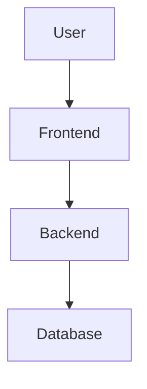

# Diagram Export Tool

Convert all Mermaid diagrams in your architecture blueprint to **presentation-quality PNG images**.

**Perfect for**: Stakeholder presentations, documentation, design reviews, Confluence/Notion embedding

---

## When to Use This Skill

Use this skill when you need to:
- Generate PNG diagrams for stakeholder presentations
- Embed architecture diagrams in documentation (Confluence, Notion, Google Docs)
- Create visual assets for pitch decks or investor updates
- Share diagrams with teams that don't have Mermaid rendering
- Prepare diagrams before running `/architect:stakeholder-doc` or `/architect:export-docx`

**Input**: Architecture blueprint (markdown file with Mermaid diagrams)
**Output**: `diagrams/` folder with PNG files

---

## Diagram Types Extracted

The tool extracts and renders these diagram types from blueprints:

### 1. Architecture Diagrams
- **C4 Container Diagram** (from Section 5: Architecture Diagram)
- **C4 Component Diagram** (if included)
- **Deployment Diagram** (from Section 5)

**File naming**: `architecture-container.png`, `architecture-component.png`, `deployment.png`

### 2. Database Diagrams
- **Entity Relationship Diagram (ERD)** (from Section 4: Database Schema)
- **Multi-tenancy Isolation Diagram** (if B2B product)

**File naming**: `database-erd.png`, `multi-tenancy.png`

### 3. Sequence Diagrams
- **Authentication Flow** (from Section 8: Security Architecture)
- **API Request Flow** (from Section 6: API Specification)
- **Real-time Update Flow** (if real-time features detected)
- **Payment Flow** (if e-commerce detected)

**File naming**: `sequence-auth.png`, `sequence-api.png`, `sequence-realtime.png`, `sequence-payment.png`

### 4. Flow Diagrams
- **User Journey Flow** (if included in blueprint)
- **Data Flow Diagram** (if included)

**File naming**: `flow-user-journey.png`, `flow-data.png`

---

## How It Works

### Step 1: Scan Blueprint for Mermaid Blocks

Extract all code blocks with `mermaid` language identifier:

```markdown

```

### Step 2: Categorize Diagrams

Identify diagram type based on:
- Section context (Architecture Diagram vs Database Schema vs Security)
- Mermaid syntax (graph, sequenceDiagram, erDiagram, C4Context, etc.)
- Content analysis (keywords like "auth", "payment", "user journey")

### Step 3: Render to PNG

Use **Mermaid CLI** or **Kroki API** to render:

#### Option A: Mermaid CLI (Local Rendering)

```bash
# Install mermaid-cli if not present
npm install -g @mermaid-js/mermaid-cli

# Render each diagram
mmdc -i diagram.mmd -o diagrams/architecture-container.png -w 1600 -H 1200 -b transparent
```

**Rendering settings**:
- Width: 1600px (presentation quality)
- Height: Auto (maintain aspect ratio, max 1200px)
- Background: Transparent
- Theme: Default (or extract from blueprint if specified)

#### Option B: Kroki API (Cloud Rendering)

If mermaid-cli not available, use Kroki public API:

```bash
# Encode diagram to base64
DIAGRAM=$(echo 'graph TD; A-->B' | base64)

# Fetch PNG from Kroki
curl https://kroki.io/mermaid/png/$DIAGRAM -o diagram.png
```

**Fallback strategy**: Try Mermaid CLI first, fallback to Kroki if CLI not installed.

### Step 4: Create diagrams/ Folder Structure

```
diagrams/
├── architecture-container.png       # Main C4 diagram
├── architecture-component.png       # Component details (if exists)
├── deployment.png                   # Hosting architecture
├── database-erd.png                 # Entity relationships
├── multi-tenancy.png                # Tenant isolation (B2B only)
├── sequence-auth.png                # Authentication flow
├── sequence-api.png                 # API request/response
├── sequence-realtime.png            # Real-time updates (if exists)
├── sequence-payment.png             # Payment flow (e-commerce only)
├── flow-user-journey.png            # User journey (if exists)
└── flow-data.png                    # Data flow (if exists)
```

### Step 5: Generate Index File

Create `diagrams/README.md` with:

```markdown
# Architecture Diagrams

Generated from blueprint on [Date]

## High-Level Architecture


*System components and how they connect*

## Database Schema


*Data model and relationships*

## Authentication Flow


*How users authenticate and authorize*

## API Request Flow


*Typical API request lifecycle*

[... additional diagrams ...]

---

**Note**: All diagrams are exported at 1600px width for presentation quality.
To re-generate, run `/architect:export-diagrams` in the project root.
```

---

## Output Format

When invoked, generate:

```
📊 Extracting diagrams from blueprint...

✅ Found 8 Mermaid diagrams in blueprint
✅ Categorized diagrams by type

🎨 Rendering diagrams to PNG...
✅ architecture-container.png (1600x890px)
✅ database-erd.png (1600x1120px)
✅ sequence-auth.png (1600x780px)
✅ sequence-api.png (1600x650px)
✅ deployment.png (1600x720px)
✅ multi-tenancy.png (1600x580px)
⚠️  sequence-realtime.png (skipped - no real-time diagram in blueprint)
⚠️  sequence-payment.png (skipped - no payment diagram in blueprint)

📁 Created diagrams/ folder with 6 PNG files
📄 Created diagrams/README.md index

Ready for presentations and documentation!

Next steps:
- Use diagrams in `/architect:stakeholder-doc`
- Embed in Confluence/Notion
- Add to pitch decks or investor updates
```

---

## Customization Options

**Optional parameters** (ask user if they want to customize):

1. **Output format**: PNG (default), SVG, PDF
2. **Width**: 1600px (default), 1200px, 2000px (for retina displays)
3. **Theme**: Default, dark, forest, neutral
4. **Background**: Transparent (default), white, custom color
5. **DPI**: 96 (screen), 300 (print quality)

**Default behavior**: PNG, 1600px width, default theme, transparent background.

---

## Diagram Quality Standards

All exported diagrams must meet these standards:

- ✅ **Minimum width**: 1200px (readable in presentations)
- ✅ **Aspect ratio preserved**: No stretching or distortion
- ✅ **Text readable**: Font size ≥12pt when displayed at 1600px
- ✅ **Colors accessible**: Sufficient contrast for colorblind viewers
- ✅ **Transparent background**: Unless user requests solid color
- ✅ **No truncation**: All labels and arrows fully visible

---

## Error Handling

### If Mermaid syntax is invalid:
- **Action**: Report which diagram has errors, show Mermaid error message
- **Example**: "⚠️ ERD diagram has syntax error: Expected 'entity' keyword at line 5"
- **Fallback**: Skip invalid diagram, continue with others

### If Mermaid CLI not installed:
- **Action**: Automatically fallback to Kroki API
- **Notify user**: "ℹ️ Using Kroki API for rendering (mermaid-cli not found)"

### If diagram is too large (>10MB):
- **Action**: Reduce width to 1200px and retry
- **Notify user**: "⚠️ Diagram too large, reduced to 1200px width"

### If no diagrams found in blueprint:
- **Action**: Error message with guidance
- **Example**: "❌ No Mermaid diagrams found in blueprint. Did you run `/architect:blueprint` first?"

---

## Integration with Other Skills

### Before running `/architect:stakeholder-doc`:
Run `/architect:export-diagrams` first to generate PNGs that stakeholder-doc can embed.

### Before running `/architect:export-docx`:
Run `/architect:export-diagrams` to create diagrams for Word document.

### After running `/architect:blueprint`:
Run `/architect:export-diagrams` to generate visual assets immediately.

---

## Examples

### Example 1: Basic Usage

```bash
# After generating blueprint
/architect:export-diagrams

# Output:
# ✅ Created diagrams/ with 6 PNG files
# Ready for presentations!
```

### Example 2: Custom Settings

```bash
/architect:export-diagrams --format=svg --width=2000 --theme=dark

# Output:
# ✅ Created diagrams/ with 6 SVG files (2000px, dark theme)
```

### Example 3: Print Quality

```bash
/architect:export-diagrams --dpi=300 --background=white

# Output:
# ✅ Created diagrams/ with 6 PNG files (300 DPI, print-ready)
```

---

## Technical Implementation

### Mermaid CLI Rendering (Preferred)

```bash
#!/bin/bash
# Extract Mermaid blocks from blueprint and render each

BLUEPRINT="blueprint.md"
OUTPUT_DIR="diagrams"

mkdir -p "$OUTPUT_DIR"

# Extract each mermaid block and render
# (Actual implementation would parse markdown and extract blocks)

# Example rendering command:
mmdc -i temp-diagram.mmd \
     -o "$OUTPUT_DIR/architecture-container.png" \
     -w 1600 \
     -b transparent \
     -t default
```

### Kroki API Rendering (Fallback)

```bash
#!/bin/bash
# Encode diagram and fetch from Kroki

DIAGRAM_CODE="graph TD; A-->B"
ENCODED=$(echo "$DIAGRAM_CODE" | base64 -w 0)

curl "https://kroki.io/mermaid/png/$ENCODED" \
     -o "diagrams/diagram.png" \
     --silent \
     --fail
```

### Diagram Extraction Logic

```typescript
// Pseudocode for extracting diagrams from blueprint

function extractDiagrams(blueprint: string) {
  const diagrams = [];

  // Parse markdown, extract code blocks with ```mermaid
  const mermaidBlocks = extractMermaidCodeBlocks(blueprint);

  for (const block of mermaidBlocks) {
    const context = getSectionContext(block); // "Architecture Diagram", "Database Schema", etc.
    const type = detectDiagramType(block.code); // graph, sequenceDiagram, erDiagram, etc.
    const filename = generateFilename(context, type); // "architecture-container.png"

    diagrams.push({
      code: block.code,
      filename: filename,
      context: context,
      type: type
    });
  }

  return diagrams;
}
```

---

## Success Criteria

A successful diagram export should:
- ✅ Extract all Mermaid diagrams from blueprint
- ✅ Render each diagram to high-quality PNG (1600px minimum)
- ✅ Use descriptive filenames based on diagram purpose
- ✅ Create diagrams/ folder with organized structure
- ✅ Generate README.md index with embedded images
- ✅ Handle errors gracefully (invalid syntax, missing tools)
- ✅ Provide clear progress and completion messages
- ✅ Be ready for immediate use in presentations and docs

---

## Files Created

```
diagrams/
├── README.md                        # Index with embedded images
├── architecture-container.png
├── architecture-component.png       # (optional)
├── deployment.png
├── database-erd.png
├── multi-tenancy.png                # (if B2B)
├── sequence-auth.png
├── sequence-api.png
├── sequence-realtime.png            # (if real-time features)
├── sequence-payment.png             # (if e-commerce)
├── flow-user-journey.png            # (optional)
└── flow-data.png                    # (optional)
```

**Total size**: Typically 1-5 MB for all diagrams combined.
